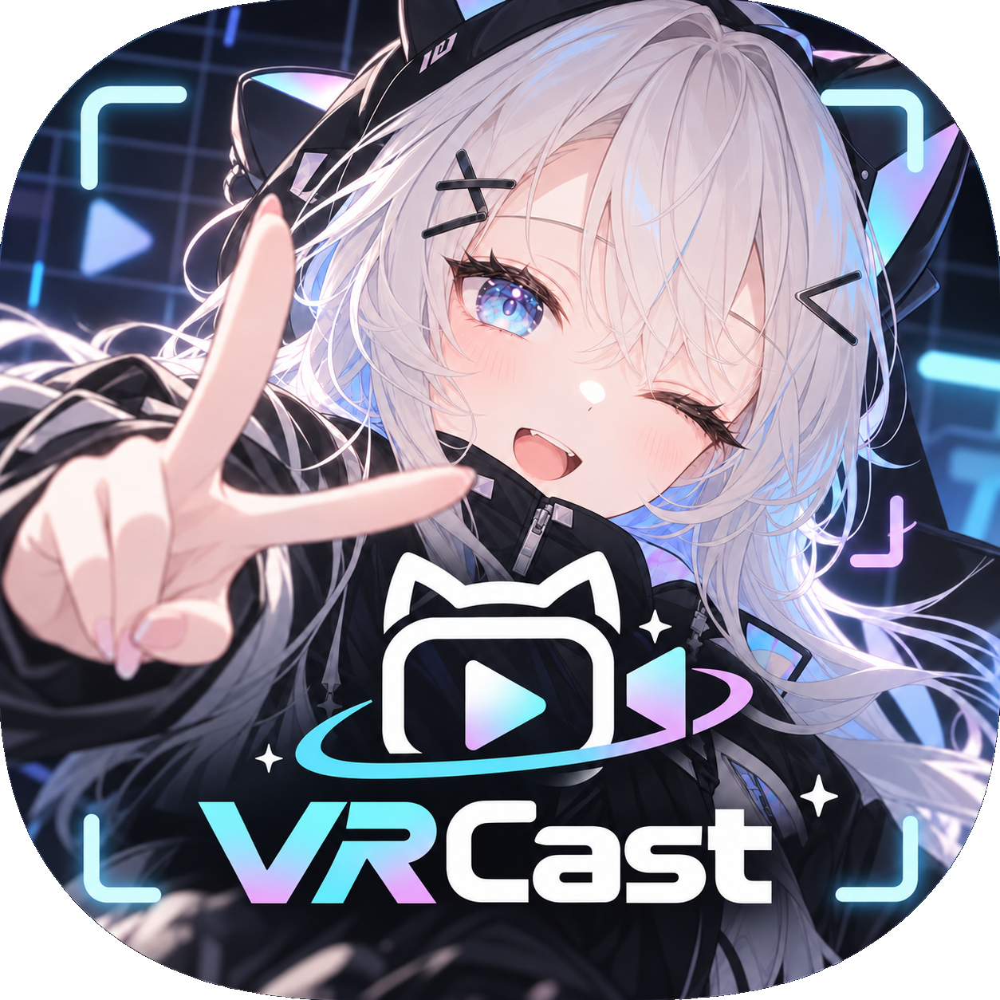

# VRCast

<p align="center"></p>

<p align="center">
  <a href="https://deepwiki.com/coffin299/VRCast"></a>
  <a href="https://github.com/coffin299/VRCast/releases/latest"></a>
  <a href="https://github.com/coffin299/VRCast/releases"></a>
  <a href="LICENSE"></a>
</p>

<p align="center">
  
  
  <a href="https://coffin299.github.io/VRCast/"></a>
  <a href="https://coffin299.booth.pm/items/8933317"></a>
  <a href="https://discord.gg/vM5RH52HdF"></a>
</p>

<p align="center"></p>

VRChat 向け 3D アバターを、Unity プロジェクトごとではなく **アバター単体に近い形** で動かす軽量スタンドアロン Runtime。
VSeeFace のように簡単にアバターを表示・トラッキングし、OBS などの配信ソフトへ出力することを目指す。

```text
VRChat アバター (Unity / VCC プロジェクト)          VRM アバター (VRoid など)
        ↓  com.vrcast.converter (Editor 専用パッケージ)      │
MyAvatar.vrcaster                                   MyAvatar.vrm（変換不要）
        ↓                                                │
VRCast.exe (Runtime)  ←──────────────────────────────────┘
        ↓
OBS (Window Capture / Game Capture / Spout2) / 仮想カメラ (Discord / Zoom など)
```

利用者は Unity Editor・VCC・VRChat 用プロジェクトを常時起動しておく必要がない設計とする。

- Web サイト（概要・ヘルプ、日本語 / 英語 / 韓国語 / 中国語 簡体字・繁体字。既定はブラウザの言語に合わせる。ライト / ダーク）: <https://coffin299.github.io/VRCast/>
  （ソースは [`webpage` ブランチ](https://github.com/coffin299/VRCast/tree/webpage)。GitHub Pages でブランチのルートを公開）
- 公式 Discord（VRCast Community。質問・要望・不具合の報告など）: <https://discord.gg/vM5RH52HdF>

## 現在の状態

**バージョン 1.16.7（製品版）**。変更点は [CHANGELOG.txt](CHANGELOG.txt)（日本語 / 英語、配布 zip にも同梱）。

**Milestone 1（Basic Avatar Runtime）**・**Milestone 2（Transparent Rendering）**・**Milestone 3（Expressions）**・**Milestone 4（Runtime Physics）**・**Milestone 5（Tracking）** 完了。
VRChat アバターを書き出して `VRCast.exe` で表示し、待機ポーズ・表情切り替えをしつつ背景透過で OBS に取り込める。

| 項目 | 状態 |
| :--- | :--- |
| Runtime / Editor の Assembly 分離 | 済 |
| ログ (`VRCastLog`) / 設定の保存・読込 (`SettingsStore`) | 済 |
| Windows ビルドスクリプト (`VRCastBuild`) | 済 |
| アバター書き出し (`VRCast > Avatar Exporter`) | 済 |
| FX レイヤー既定状態の焼き込み（小物トグルの初期 ON/OFF） | 済 |
| `.vrcaster` 読み込み・表示・オービットカメラ・最小 UI | 済 |
| VRM（0.x / 1.0）の直接読み込み（UniVRM。表情・まばたき・口の形・揺れものを変換） | 済 |
| Humanoid 骨格基準のカメラフレーミング | 済 |
| 背景透過・解像度プリセット・ライト調整 | 済 |
| 待機ポーズ（既定は気を付け。腕を下ろす・肘の曲げ） | 済 |
| 待機モーション（呼吸・体の揺れ・頭のゆらぎ。強さ・速さを調整、顔のトラッキング中は頭を本人に任せる） | 済 |
| 表情プリセット（FX の BlendShape クリップから抽出、ショートカットキー切替） | 済 |
| 自動まばたき（ON/OFF）・マイクリップシンク（母音 あいうえお） | 済 |
| BlendShape ごとの上限（アバターごとに保存） | 済 |
| 揺れもの（PhysBone 近似・コライダー） | 済 |
| カメラトラッキング（OpenSeeFace 同梱: 頭の向き・上半身の傾き・まばたき・口） | 済 |
| 視線（目ボーン）・左右別ウインク | 済 |
| MediaPipe トラッカー（顔 + 腕・手・指、既定の入力元。OpenSeeFace と切替可） | 済 |
| iPhone・外部アプリからの顔トラッキング（VMC プロトコル受信。Waidayo 等の ARKit の値） | 済 |
| iFacialMocap からの顔トラッキング（独自形式の受信） | 済 |
| 表情反映（MediaPipe・VMC・iFacialMocap のみ。笑顔・驚き・怒り・悲しみ → 表情プリセット） | 済 |
| パーフェクトシンク（MediaPipe・VMC・iFacialMocap のみ。ARKit 名の BlendShape を直接動かす） | 済 |
| 表示言語（英語 / 日本語 / 韓国語 / 中国語 簡体字・繁体字）・クレジットタブ | 済 |
| デバッグログタブ（重要度・カテゴリ・文字列の絞り込み、環境の要約、コピー） | 済 |
| Constraint（VRC / Unity 標準の Position・Rotation・Scale・Parent・Aim・LookAt） | 済 |
| 仮想カメラ出力（VRCast Camera、Discord / Zoom 等） | 済 |
| Windows 11 の仮想カメラ（Media Foundation、VRCast Camera (MF)。出力タブで従来方式と切替） | 済 |
| Spout2 出力（OBS へ GPU 上で共有、透過のまま） | 済 |

ロードマップは [docs/milestones.md](docs/milestones.md) を参照。

## 動作環境

- Windows 10 / 11 (x64)
- アバターの書き出し: Unity **2022.3.22f1**（VRChat SDK と同一バージョン）
- VRCast 本体の開発: Unity **2022.3 LTS の最新版**（2022.3.62f3 以降。AssetBundle を読めるよう 2022.3 系列にとどめる。Unity 6 は不可）
  - ビルドは IL2CPP。Unity Hub で「Windows Build Support (IL2CPP)」モジュールと、Visual Studio の「C++ によるデスクトップ開発」ワークロードを入れておく
  - VRM の読み込みに使う UniVRM（`com.vrmc.gltf` / `com.vrmc.vrm`、v0.131.3）は Package Manager が GitHub から取得するため、Git が必要
- Render Pipeline: Built-in

## 使い方

VRM（VRoid Studio などで作った `.vrm`）は書き出し不要で、そのまま「2. VRCast.exe で表示する」へ進める（「VRM を読み込む場合」を参照）。

### 1. アバターを .vrcaster に書き出す

アバターがある Unity プロジェクト（VCC プロジェクト可、Unity 2022.3.22f1）に Converter パッケージを導入する。

- 配布 zip の `VRCast-Converter` フォルダに入っている `VRCast-Converter-<バージョン>.unitypackage` をダブルクリック（または Unity にドラッグ＆ドロップ）して **Import**。
  `Assets/VRCast/Converter/` に入る。更新は新しい版を同じ手順で上書きインポート。
- または Package Manager > `+` > **Add package from git URL...**（Git が必要）
  `https://github.com/coffin299/VRCast.git?path=/Packages/com.vrcast.converter`
- またはローカルのクローンから **Add package from disk...** で `Packages/com.vrcast.converter/package.json` を選択
- unitypackage と Package Manager の両方で入れると同じ名前のアセンブリが重複してエラーになるため、どちらか一方にする。

メニュー `VRCast > Avatar Exporter` を開き、シーン上のアバタールート（Animator 付き）を指定して **Export...**。

- ウィンドウ・ダイアログは英語 / 日本語 / 韓国語 / 中国語（簡体字・繁体字）に対応。既定は OS の言語で、ウィンドウ上部の **Language** で切り替えられる（EditorPrefs に保存）。Console のログは英語のまま。
- ウィンドウのヘッダーとタブにアプリアイコン（`Editor/VRCastIcon.png`、128px に縮小したもの）を表示。UPM と unitypackage で置き場所が違うため GUID で読み込む。

- 書き出されるのは Unity 標準コンポーネント（Transform / Animator / Renderer / MeshFilter）とそのメッシュ・マテリアル・シェーダー・テクスチャのみ。
- VRChat コンポーネント・スクリプト・Animator Controller は書き出し用の複製から除去される（元のアバターは変更されない）。
- シーン上で非アクティブ（インスペクターのチェックを外した）オブジェクトは子ごと書き出さない。
  FX の初期状態で表示されるものや、Modular Avatar の衣装も含めて除く（表示させたいものはアクティブにしてから書き出す）。
  EditorOnly タグのオブジェクトも子ごと除く。
- 【ベータ版・暫定対応】Modular Avatar など NDMF ベースの非破壊改変ツールが入っている場合、除去の前に複製へ改変を適用する（VRChat へのアップロード時と同じ処理）。
  衣装の統合（Merge Armature）や追加した FX レイヤー（Merge Animator）も反映される。書き出し中に生成したアセットは終了後に削除する。
  NDMF の実行前に MA Merge Armature / Bone Proxy の設定を控え、NDMF で統合されなかった衣装・小物（NDMF 未導入や MA 内部の失敗）は、
  VRCast がボーン名の対応でアバターのボーンの子へ付け替えて追従させる（付け替えで変わったパスは FX の焼き込み時に読み替える）。
- 除去前に、FX レイヤーの初期状態（Expression Parameters の既定値で到達するステート）から、
  小物の表示 ON/OFF・BlendShape・マテリアル差し替えを焼き込む（ポーズと Transform は変更しない。近似処理のため完全一致ではない）。
  BlendShape は既定ではシーン上の値を優先し、書き出し画面の「シーンのブレンドシェイプの値を優先する」を OFF にしたときだけ FX の値を焼き込む。
- FX 内の BlendShape だけを動かすクリップ（表情クリップ）を表情プリセットとして `metadata/expressions.json` に書き出す。
  FX のそれ以外のクリップ（小物の切り替えなども含む・値がすべて 0）も BlendShape の部分だけを `hidden: true` として書き出し、
  アプリのポーズタブの「ほかのクリップも表示」を ON にしたときだけ表情一覧に出す。
  FX に入っていない表情（昔のアバターに付属する表情アニメーションなど）は、書き出し画面の **追加の表情** に
  AnimationClip かフォルダ（サブフォルダ内も対象）をドラッグ＆ドロップして追加できる（BlendShape を 1 つでも動かすクリップが対象で、
  小物の切り替えなども含む場合は BlendShape の部分だけ、値がすべて 0 なら戻す用の表情として入る。
  FaceEmo・FX と同じクリップは二重に入れず、名前が重なる場合は `名前 (2)` のように番号を付ける）。指定はアバターごとに EditorPrefs へ保存される。
  欄の下に、書き出す前にクリップごとの判定（✓ / ✗ と補足: ブレンドシェイプ以外も動かす・ブレンドシェイプを動かさない・多すぎる・すべて 0）を表示する（クリックでプロジェクト上の場所を表示）。
- シーンに [FaceEmo](https://github.com/suzuryg/face-emo) の設定（対象アバターが書き出すアバター）があれば、その表情を FX より優先して取り込む。
  モードは FaceEmo の表示名、ハンドジェスチャーの分岐はクリップ名を使い、BlendShape 以外のカーブ（小物の表示など）は無視する。
  改変適用後の Expression Menu に名前が「FaceEmo」を含むサブメニューがあれば、その中のボタンが切り替えるパラメータと値から
  FX で再生されるクリップを探し、メニューの名前で取り込む（VRChat と同じ道筋。同じ名前の表情は FaceEmo の設定から読んだものより優先）。
  BlendShape が 1 つでもあるモードは見送らずに取り込む（値がすべて 0・多すぎる場合も。同じクリップでもモード名が違えば別の表情）。
  FaceEmo のアセンブリは参照せず型名で読むため、FaceEmo が無いプロジェクトでもそのまま動き、「アバターに適用」前でも取り込める。
  最適化ツール（メッシュの統合など）で顔のメッシュの場所が変わっても、同じ BlendShape を持つメッシュへ付け替えて書き出す。
  決められないときは顔のメッシュ（Avatar Descriptor のリップシンク・まぶたのメッシュ）とみなす。
  AAO（Avatar Optimizer）の Trace and Optimize があれば、書き出す複製でだけ BlendShape の最適化を止める
  （FX で動かない BlendShape が消され、FaceEmo で編集した表情などが動かなくなるのを防ぐ）。
- Avatar Descriptor の Lip Sync（Viseme / JawFlap BlendShape）と Eyelids（BlendShape）設定を `metadata/descriptor.json` に書き出す。
  Eyelids 未設定の場合は顔メッシュの `まばたき` / `blink` / `eyeBlinkLeft`+`eyeBlinkRight` 等をまばたき用として推定する。
  ウインク用 BlendShape（`ウィンク`+`ウィンク右`、`wink_L`+`wink_R` 等）も推定して書き出す。
- PhysBone / PhysBone Collider の主要パラメーターを `metadata/physbones.json` に書き出す（Runtime で近似的に揺らす）。
- VRC Constraint と Unity 標準の Constraint を `metadata/constraints.json` に書き出す（Runtime で毎フレーム評価。手に持たせた小物等が追従する）。
  アバター外を指すソースと Freeze To World は対象外。
- Modular Avatar の **Blendshape Sync** を `metadata/blendshape_sync.json` に書き出す（NDMF の実行前に控え、改変後のパスで書く）。
  MA はアニメーションにしか同期を書き足さないため、Runtime が毎フレーム同期元の値を同期先へ写し、
  口に付いたチェーンなどを口パク・まばたき・トラッキング・表情に追従させる（同期先の BlendShape の上限は効く。Remap カーブは未対応）。
- 書き出し先は Windows スタンドアロン用 AssetBundle。Android (Quest) ビルドターゲットのプロジェクトでは切替に時間がかかる。

### 2. VRCast.exe で表示する

- `.vrcaster` / `.vrm` ファイルを VRCast のウィンドウへドラッグ＆ドロップすると読み込む（複数ドロップした場合は最初の対応ファイル）。
- または Avatar タブの **Browse...** でファイルを選ぶか、入力欄にパスを入力して **Load**（前後の `"` は自動で除去）。
- Avatar タブの **最近使ったアバター** に直前に使ったアバターが最大 10 件並び、クリックで切り替えられる。タイルの名前の下には入れた日時（ドロップ・参照・読み込みボタンで読み込んだ日時。一覧からの切り替えでは変わらない。以前の版の記録はファイルの更新日時で補う）を表示する（× を押すとタイルが「外しますか？」の確認に変わり、「外す」で一覧から外す。記憶した設定も消える。「やめる」で戻る）。
- 一覧は画像付きのタイルで、タイルの「画像」で PNG / JPG / GIF（GIF はアニメーション）を設定できる。表示中のアバターには画像をウィンドウにドロップしても設定でき、「状態」の「画像を外す」で外す。画像は設定フォルダの `Thumbnails` にコピーして使う。
  カメラの視点・ライト・アバターの明るさ・輪郭線の太さ・待機ポーズ・体の向きはアバターごとに記憶され、切り替え時（再起動後も含む）に戻る。
- `.vrcaster` / `.vrm` 以外のファイル・存在しないファイルは読み込まず、表示言語でエラーを表示する
  （パネルを隠していてもドロップに失敗したときは表示される）。
- VRCast を管理者として実行している場合、Windows の制限によりエクスプローラーからのドロップは受け付けられない（Browse を使う）。
- 起動引数でも指定可能: `VRCast.exe --avatar "C:\path\MyAvatar.vrcaster"`（`.vrm` も可）
- 最後に読み込んだアバターは次回起動時に自動で読み込まれる。

#### VRM を読み込む場合

- VRM 0.x / 1.0 に対応（UniVRM で読み込み、0.x は 1.0 へ変換して扱う）。Avatar タブの状態に `VRM 1.0` / `VRM 0.x` と作者を表示する。
- VRM の設定を `.vrcaster` の metadata と同じ形へ変換し、トラッキング・待機ポーズ・カメラ出力などは `.vrcaster` と同じように使える。
  - 感情（Happy / Angry / Sad / Relaxed / Surprised）と独自の表情 → 表情プリセット（Pose タブ・ショートカットキー・トラッキングの表情反映）
  - `blink` / `blinkLeft` / `blinkRight` → 自動まばたき・ウインク、`aa` / `ih` / `ou` / `ee` / `oh` → マイクの口パク（あいうえお）
  - SpringBone（揺れもの）とコライダー → PhysBone の近似（Display タブの揺れもの ON/OFF も有効）
- まばたき・口の形は 1 つのメッシュの BlendShape だけを使う（最も多く使われているメッシュ）。重みは 100 で動かす（BlendShape の上限で調整できる）。
- マテリアルの色・UV を変える表情は反映されない（BlendShape を動かさない表情は一覧に出ない）。VRM の Node Constraint・視線の BlendShape 方式（目ボーンの無いモデル）は未対応。
- 見た目は MToon（UniVRM の MToon10）で描画する。ビルド時に `VRCastBuild` が MToon・UniUnlit・Standard を Always Included Shaders に追加する。
- VRM に書かれた利用条件（アバターの使用許可・商用利用など）を守って使うこと。

| 操作 | 内容 |
| :--- | :--- |
| 右ドラッグ | カメラ回転（Display タブの「カメラを固定」が ON の間は無効） |
| 中ドラッグ | パン（同上） |
| ホイール | ズーム（同上） |
| Tab | 操作パネルの表示切替（隠している間は OBS で背景も透過） |
| 割り当てたキー | 表情プリセット切替 / ニュートラル（Pose タブで表情ごとに割り当て。テンキー・記号キー・修飾キー単独・Ctrl / Alt / Shift の組み合わせ可、既定は未割り当て、背面でも有効） |
| テンキー 1〜5 | リセット（1 顔の向き / 2 視線 / 3 表情 / 4 カメラ）と 5 カメラ目線の ON / OFF。パネル下部のボタンと同じ。Settings タブで変更・解除可、NumLock ON、背面でも有効 |

操作パネルは左のタブ（Start / Avatar / Pose / Face / Shape key setup / Tracking / Display / Output / Settings / Debug log / Credits / Official Discord）で項目を切り替え、内容は縦にスクロールする。
配色は背景のベージュに合わせた濃いめのベージュ（焦げ茶の文字、キャラメル色のアクセント）。
パネル下部には、どのタブでも押せるリセットボタン（**Head** 顔の向き / **Gaze** 視線 / **Expression** 表情をニュートラルへ / **Camera** カメラ）と、**Look at camera**（カメラ目線。ON の間は押し込んだ表示）を常に表示する。
同じ操作はショートカットキーでも行える（パネルを隠していても有効。既定はテンキー 1〜5 で、**Settings** の **Shortcut keys (reset / look at camera)** で変更・解除・既定に戻す・背面でも使うかを選べる。割り当て方は表情のショートカットキーと同じ）。各ボタンの 2 行目に割り当て中のキー（例: `キー: Num 1`、未割り当てなら「未割り当て」）を表示する。
表情のショートカットキーと同じ組み合わせにすると表情が優先され、そのリセットはキーでは動かない（Settings の行と Pose タブの表情の行の両方に警告が出る）。
その下にアンケート欄（次に対応してほしい機能などの募集。ほかの欄と同じ見た目で、[GitHub の Issue](https://github.com/coffin299/VRCast/issues/11) か [Google フォーム](https://forms.gle/L8z1P6SXZ23SnwWa8) を開くボタンを表示）、
さらにその下に動作状況（**FPS** 描画のフレームレートと 1 フレームの時間 / **CPU** VRCast の CPU 使用率 / **GPU** 1 フレームの GPU 処理時間 / **Tracker CPU** 同梱トラッカーの CPU 使用率 / **Tracking** トラッキングの受信レート）を英語で表示する。
1 秒ごとに更新し、**Settings** の **Show performance stats**（既定 ON）で隠せる。CPU 使用率はタスクマネージャーと同じく全論理コアに対する割合。
見出しの「VRCast」の横にはバージョン番号（例: `v1.11.3`）を表示する。
パネルは見出し部分をドラッグして移動でき、高さは画面に収まるよう自動で調整される。

- **Start**（はじめに、起動時に開く）: アバターの読み込み → 背景の透過 → OBS への取り込み → パネルを隠す、までを手順で案内する。
  読み込み・透過は完了 / 未完了を表示し、その場のボタン（ファイルを選ぶ / 透過にする）で操作できる。仮想カメラ・トラッキング・口パクのタブへも移動できる。
- **ヘルプ**: 見出しの **?**、Start / Settings の **Open help** で Web のヘルプページ（[coffin299.github.io/VRCast/help](https://coffin299.github.io/VRCast/help/)、日本語 / 英語 / 韓国語 / 中国語 簡体字・繁体字）をブラウザで開く（パネルの表示言語で開く）。
- **表示言語**: パネル上部（見出しの下）の言語ボタン、または **Settings** の Display language で「自動（OS に合わせる）」/ English / 日本語 / 한국어 / 简体中文 / 繁體中文 を選べる
  （既定は自動。OS が日本語なら日本語、韓国語なら韓国語、中国語なら簡体字 / 繁体字、それ以外は英語）。Web サイト・ヘルプページも同じ 5 言語で、既定はブラウザの言語に合わせる（配布物の説明 README.txt は日本語 / 英語）。
- **Debug log**（デバッグログ）: カメラが認識されない等の原因調査用。環境の要約（バージョン・OS・CPU・GPU・トラッカーと受信の状態・カメラ一覧）と、
  起動直後からのログ（最大 2000 件、アプリを閉じると消える）を表示する。**DEBUG / INFO / WARN / ERROR** の表示切替（件数付き）、カテゴリ（`Tracker` / `TrackerOutput` / `Tracking` がカメラ関係）、
  文字列検索、新しい順 / 古い順で絞り込め、表示中のログを環境と一緒にコピーできる（不具合報告にそのまま貼れる）。
  トラッカー自身の出力（`TrackerOutput`）と DEBUG はこのタブにだけ残し、Player.log には書かない。**ログフォルダ** で Player.log のあるフォルダを開く。
  - **トラッカーの状態**（常に記録）: 起動したコマンドライン・PID、終了コードとその意味（カメラが開けない / フレームが届かない / DLL 不足など）と動作時間、
    カメラ一覧の取得時間、最初のパケットの送信元、データの途絶（3 秒）・待ち受け開始から 15 秒届かない、入力元の設定違いの推定（MediaPipe を選んで OpenSeeFace のデータが届く等）。
    同梱の MediaPipe 版は Python / OpenCV / MediaPipe の版、カメラ名と実際の解像度・FPS・バックエンド、最初のフレームの明るさ、モデルの読込時間、最初に人を検出した時刻、読み取り・送信の失敗を `INFO:` / `WARN:` / `ERROR:` 付きで出し、重要度に振り分ける。
    顔も体も 10 秒検出されないと、映像の明るさ・ばらつきから原因の目安（ほぼ単色 = 仮想 / 赤外線カメラ・レンズカバー・他アプリが使用中、暗すぎる、映像は普通 = カメラの向き）を警告する。
    `--save-frame <ファイル>` でカメラの映像を 1 枚 JPEG に保存できる（手動で起動して何が映っているかを確認する用。VRCast からは渡さない）。
    容量対策として 1 回の起動で 1 枚だけ・同じファイルに上書き（フォルダ指定は拒否）、長辺 640px に縮小・品質 80 で数十 KB 程度。
  - **仮想カメラ・赤外線カメラ**: 名前に `VRCast Camera` / `Unity Video Capture` / `Virtual` / `VCam` / `IR Camera` / `Infrared` を含むカメラは顔を映せないとみなし、
    自動選択では実カメラを優先、選んでいる場合はトラッキングタブとデバッグログで警告する。
  - **詳細ログ**（スイッチ、既定 OFF、設定に保存）: ON の間だけ DEBUG を記録する。受信側の 5 秒ごとの統計（パケット/秒・サイズ・不正件数・顔 / 腕 / 手が映っていた割合）と顔の検出 / 見失い、
    MediaPipe 版の `STATS:` 行（カメラ FPS・推定 FPS・モデルごとの推定時間・検出率・間引き / 失敗の件数。`--status-interval` 秒ごと、既定 5）。
  - **負荷対策**: 連続した同じログは 1 行にまとめて回数（×N）を表示、トラッカー出力の INFO は毎秒 30 行まで（超えた分は件数だけ警告）、
    不正パケットの警告は 10 秒に 1 回、統計は詳細ログ OFF なら文字列も作らない、一覧の作り直しは 0.25 秒に 1 回まで、配布版では通常ログ・警告のスタックトレースを取らない。
- **Official Discord**（公式 Discord、タブ列の一番下）: [公式 Discord](https://discord.gg/vM5RH52HdF) に参加するボタンと、Discord のウィジェットと同じ内容
  （サーバー名・オンライン人数・オンラインのメンバーのアイコン・状態・名前。`widget.json` から取得）を表示する。情報はこのタブを開いている間だけ取得し、1 分ごと・**Refresh** で取り直す。
  その下に招待コード（`vM5RH52HdF`）と招待リンクを表示し、それぞれ **Copy** でコピーできる（Discord アプリの「サーバーに参加」に入力する用）。
- **Credits**（クレジット）: 開発者（ごみぃ）・協力者（Arche_039、おけパ）のリンク（名前のボタンで X、その右に YouTube 等があれば並べる）、開発者の Twitch チャンネル（[coffinnoob299](https://www.twitch.tv/coffinnoob299)）へのリンクと、ライセンス・NOTICE を GitHub で開くボタン（配布物にも `LICENSE.txt` / `NOTICE.txt` を同梱）
  （配布フォルダにファイルが無い場合は GitHub のファイルを開くボタンになる）。
- **UI の大きさ**: **Settings** の UI size で 75% / 100% / 125% / 150% / 200% を選べる（高解像度ディスプレイ向け）。
- **テーマ**: **Settings** の Theme で **Light**（既定、ベージュ）/ **Dark**（暗い茶系）を選べる（OS の設定には合わせない）。
  背景色が既定色のままならテーマに合わせて切り替わる（ライト = ベージュ、ダーク = ダークグレー。Display で変更した色は残す）。
- **軽量モード**（既定 ON）: **Settings** の **Low load mode** が ON の間は、描画を 30fps（OFF なら 60fps）に抑え、OpenSeeFace は軽いモデルを使う。
  ゲームや OBS との併用向け。滑らかさを優先するなら OFF にする。MediaPipe の重さは下の **トラッカーの動作** で決める。
- **トラッカーの動作**（MediaPipe のみ、既定「ぬるぬる」）: **Tracking** の **Tracker mode** で選ぶ。変更するとトラッカーを起動し直す。
  - **Fluid**（ぬるぬる（高負荷））: 「なめらか」に加え、手が映っている間は手を毎フレーム推定する（指の動きが細かくなる分、CPU 負荷は上がる）。
  - **Smooth**（なめらか）: 推定の上限なし（カメラの fps、通常 30fps まで）。顔・表情は毎フレーム、腕・手は 2 フレームに 1 回推定する。
  - **Eco**（エコ）: 推定を毎秒 20 回まで。腕・手は 3 フレームに 1 回。負荷は「なめらか」の半分ほど。
  - どれも、手が映っていない間は手を探す回数を減らす（ぬるぬる・なめらか: 4 フレームに 1 回、エコ: 9 フレームに 1 回）。カメラは別スレッドで読み続け、推定は常に最新のフレームで行う。
  - VRCast 側では、届いた腕・手の値へ描画の毎フレーム、速度を持つバネ（`SmoothDamp`）で寄せる（届く間隔が揺れても止まったり跳ねたりしない）。
  - 担当は、顔 = Face Landmarker、体（肩・肘・手首）= Pose Landmarker（lite）、手・指 = Hand Landmarker（MediaPipe Hands）。
    Hand Landmarker は新しく手を見つける閾値を既定（0.5）のまま、一度見つけた手は低めの手らしさの閾値（0.4。位置の一致度は既定の 0.5）で追い続け、見失いを減らす。
  - 手が顔にかぶっている間（画像上の顔の範囲の 10% 以上に手が重なってから 5% 未満になるまで、最長 3 秒）は、
    頭の向きを隠れる前の値で止めて送る（顔の推定が崩れて頭が暴れるのを防ぐ。顔を見失った場合は表情も隠れる前の値）。
- **プロセスの優先度**（既定「通常」）: **Settings** の **Process priority** で 通常以下 / 通常 / 通常以上 / 高 を選べる。
  VRCast 本体と同梱トラッカーに同じ優先度をすぐ反映する（リアルタイムは選べない）。
  VRCast 本体とトラッカーは、背面にある間も Windows の電力調整（EcoQoS）で遅くならないよう常に対象外にしている。
- **3D V-Cache の無い側のコアで動かす**（既定 ON。表示は全ての PC、効果があるのは 2 CCD の X3D（7950X3D / 9950X3D 等）だけ）:
  ゲームを検知すると AMD のドライバーがキャッシュの無い側の CCD を休ませ、VRCast もゲームと同じコアに集まる。これを避けるため、
  L3 の大きさから CCD を判定し、VRCast 本体と同梱トラッカーを L3 の小さい側のコアだけで動かす（プロセスの CPU 割り当て。すぐ反映、OFF で全コアに戻す）。
  VRCast 自体がゲームと判定される場合は、Game Bar（Win + G）の設定で「これをゲームとして記憶する」を外す。
- **使うコア（Intel）**（既定「自動」。表示は全ての PC、効果があるのは P コア / E コアのある CPU（Intel 第 12 世代以降・Core Ultra 等）だけ）:
  **E コアのみ**（P コアをゲームに譲る。トラッキング・描画は遅くなることがある）/ **P コアのみ**（速いがゲームと取り合う）を選べる。
  コアの種類は Windows の EfficiencyClass で判定する。すぐ反映。
  どちらの設定も、対象の CPU とこの PC が対象かどうかを設定の下に表示する。
- **描画に使う GPU**（既定「自動」）: **Settings** の **GPU for drawing** で、Windows の優先設定（自動 / 省電力 / 高パフォーマンス。
  Windows の「グラフィックの設定」と同じ値を VRCast.exe について書く）か、GPU を一覧から直接選べる。反映は VRCast の起動し直し後（**Restart VRCast now** で VRCast だけを起動し直せる。PC の再起動は不要）。
  直接指定では、起動時に指定の GPU でなければ Unity の起動引数（`-force-device-index` / `-adapter`）を付けて自動で起動し直す。
  切り替えられなかったときは画面とデバッグログに表示する。同梱トラッカーは CPU で動くため GPU の設定は関係しない。
- **NVIDIA のインスタントリプレイに検知させない**（既定 OFF、NVIDIA の GPU がある PC だけ表示）: **Settings** の **Hide VRCast from NVIDIA Instant Replay** を押したときだけ、
  NVIDIA のドライバー設定にプロファイル「VRCast」（VRCast.exe、非公開の設定 `0x809D5F60 = 0x10000000`）を書き、
  VRCast がインスタントリプレイ（ShadowPlay）にゲームとして検知されないようにする。
  **Let NVIDIA Instant Replay detect VRCast again** でプロファイルを消して元に戻す。反映は VRCast の起動し直し後。
  非公式の設定のためドライバーによっては効かない。VRCast.exe が既に別のプロファイルに入っていれば書き換えない。
  書き込めないときは NvAPI のエラー番号を表示する（その場合は管理者として実行して試す）。エディターでは押せない。
- **アップデートの確認**（既定 ON）: 起動時に Web サイトの `https://coffin299.github.io/VRCast/version.json` を 1 回だけ読み、
  新しいバージョンがあればパネル上部に通知する（**今すぐ更新** / **GitHub からダウンロード** / **BOOTH からダウンロード** / **更新履歴を表示する（GitHub）**）。
  確認の通信は最新のバージョン番号を読むためだけで、失敗しても何も表示しない。**Settings** の **Check for updates at startup** で OFF にできる。
- **自動アップデート**: 通知の **Update now**（今すぐ更新）を押すと、GitHub Releases の配布 zip をダウンロードし（進み具合を表示、キャンセル可）、
  `version.json` に書かれた大きさと SHA-256 が一致したときだけ展開して、VRCast を終了 → ファイルを入れ替え → 自動で起動し直す。設定・アバターはそのまま。
  - 入れ替えは同梱のアップデーター（`VRCastUpdater.exe`）が行う。VRCast とトラッカーの終了を待ち、中身が同じファイルは触らず、
    変わったファイルだけを VRCast フォルダ内の隠しフォルダ `.vrcast-update-backup` へ退避してから置く。途中で失敗したら元に戻して元の版を起動し、理由を表示する。
    OBS・Discord などが仮想カメラ（UnityCapture）の DLL を読み込んだままでも更新できる（退避した旧ファイルは次回以降の起動時に削除）。
  - 更新後の最初の起動で「更新しました」を表示する。アバターのプロジェクトに入れた書き出しツール（unitypackage）は自動では更新されない。
  - VRCast が管理者権限の必要なフォルダ（Program Files など）にある場合とエディターでは自動更新せず、手動の入手先だけを出す。
  - 作業フォルダは `%LOCALAPPDATA%\VRCast\update`（ダウンロードした zip・展開したファイル・アップデーターのログ `updater.log`）。
  - 自動更新が入る前のバージョン（1.12.5 以前）からは、一度だけ手動で更新する。
- **全設定のリセット**: **Settings** の赤いボタン **Reset all settings** → 確認の **Yes, reset** で全ての設定を初期状態に戻す
  （ウィンドウサイズと最後に開いたアバターは保持。元に戻せない）。
- **設定プリセット**: **Settings** の **Settings preset** で、設定をカテゴリごとに選んで `.vrcastpreset` ファイルへ書き出し（**Export...**）、
  別の PC や後から読み込める（**Import...**、またはウィンドウへのドロップ）。読み込みはすぐには反映せず、ファイルに入っているカテゴリを選んでから **Apply** で反映する。
  - カテゴリ: 動作最適化（軽量モード・優先度・CPU・GPU の優先設定・トラッカーの動作）/ 背景・カメラの固定 / 待機モーション・揺れもの / まばたき・口パク /
    トラッキング / 出力 / ショートカットキー・OSC / HTTP / パネル（言語・大きさ・テーマ・アップデート・ログ）と、
    アバター関連の「ライト・明るさ・輪郭線・ポーズ・向き」「表情反映の割り当て・しきい値」。**Exclude avatar-related** でアバター関連だけをまとめて外せる。
  - 含めないもの: アバターごとの記録（シェイプキーの上限・カメラの視点・表情のキー・一覧の画像）、ウィンドウサイズ、
    PC ごとに違う値（マイク・トラッカーのカメラとパス・描画に使う GPU の直接指定・受信や外部操作のポート・iPhone の IP アドレス）。
  - 中身は UTF-8 の JSON テキスト。`categories` の下にカテゴリごとのブロックがあり、キーは `settings.json` と同じ。
    いらないカテゴリのブロックや項目を消してもよく、消したものは読み込み時に今の値のまま残る。知らないカテゴリ・キーは無視し、
    カテゴリに属さないキー（別カテゴリ・除外の項目）を書き足しても反映しない。`formatVersion` が新しいファイルは読める項目だけを反映する。

```json
{
    "format": "VRCastPreset",
    "formatVersion": 1,
    "appVersion": "1.16.7",
    "createdAt": "2026-10-10T08:30:00+09:00",
    "categories": {
        "performance": { "lowLoadMode": true, "trackerMode": 1 },
        "avatarLook": { "lightIntensity": 1.2, "poseArmDown": 1.0 }
    }
}
```

- 以下の説明は英語表示の項目名で記載する（日本語表示では対応する日本語名になる）。

**Pose** タブで、アバターの向き（Body yaw）と、T ポーズから腕を下ろす度合い（Arms down）・肘の曲げ（Elbow bend、Humanoid のみ）を調整できる（設定は保存される）。
既定は気を付けの姿勢（Arms down 1 / Elbow bend 0）。ボタンで Attention（気を付け）/ Relaxed（腕を少し開き肘を軽く曲げる）/ T-Pose に切り替えられる。
ポーズは保存され、次回起動時は前回の値で始まる（初回のみ Attention）。
**Idle motion**（待機モーション、既定 ON、Humanoid のみ）は、Web カメラを使っていないときにアバターが完全に止まって見えないよう、呼吸・体の揺れ・頭のゆらぎを今の姿勢へ少し上乗せする。
**Breathing and sway** を OFF にすると止まる。ON のときは **Breathing** / **Body sway** / **Head motion** の強さ（0〜2、1 が標準）と **Speed**（0.5〜2 倍）を調整できる。
顔のトラッキング中は頭のゆらぎを止めて、本人の動きに任せる。
**Expressions** には書き出し時に抽出した表情が並び、クリックまたはショートカットキーで切り替えられる（約 0.2 秒かけてなめらかに変わる）。
- ショートカットキーは表情（ニュートラル含む）ごとに割り当てる。既定はすべて **Unassigned**（未割り当て）。各行のキーのボタンを押すと割り当て待ちになり、
  押したキーが Ctrl / Alt / Shift の同時押しも含めて割り当てられる（例: `N`、`Ctrl+N`、`Ctrl+Alt+N`、`Num 1`。**Esc** でやめる）。
  キーは Windows の仮想キー番号で記録・判定するため、ほぼ全キーを使える: テンキー（数字キーと区別。NumLock ON のとき）、記号キー、F1〜F24、
  変換 / 無変換などの日本語キー、メディアキー、マウスのサイドボタン、左右を区別した Ctrl / Alt / Shift / Win の単独（修飾キーは押して離すと単独で割り当て）。
  使えないのは Esc（割り当てをやめる）、Tab（パネルの表示切替）、マウスの左右・中ボタン、半角 / 全角（押すたびに番号が変わる）。
  テンキーの Enter は Enter と区別できない。NumLock ON で Shift+テンキーは Windows の仕様で別のキー（End など）になる。
  修飾キーは完全一致で判定する（`Ctrl+N` の表情は `N` や `Ctrl+Shift+N` では切り替わらない）。同じ組み合わせを別の表情に割り当てると、前の表情からは外れる。
  隣の **Reset** で割り当てを外す。割り当てはアバターごとに表情プリセット名で保存される。
- **Also work when VRCast is in the background**（背面でも使う、既定 ON）: OBS などが前面にあっても反応する（Windows の `GetAsyncKeyState` で押下を見るだけで、キーをほかのアプリから奪わない）。
  ほかのアプリで文字入力中も反応するため、Ctrl / Alt との組み合わせかテンキーを推奨。
  OFF なら VRCast のウィンドウが選択されている間だけ効く（パネルを Tab で隠していても効く。VRCast 内のテキスト入力中は効かない）。
- 手動（ボタン・ショートカットキー・外部操作）で選んだ表情は**固定**され、トラッキングの表情の自動検出では変わらない（「表情を固定中」と **Back to auto** が出る）。
  同じ表情のボタン・キーをもう一度押すか、**Back to auto** / 下部の Reset の **Expression** で固定を外し、自動検出に戻る（自動検出が動いていなければニュートラル）。
  ニュートラルを選んで固定すると、自動検出を一時的に止められる。
- **OSC / HTTP** タブ（Output と Settings の間）の **External control (OSC / HTTP)**（外部から操作、既定 OFF）: Stream Deck・OSC アプリ・curl などから表情を切り替える。
  ポートの下に OSC の送信先（`127.0.0.1:ポート`）と HTTP の接続先 URL（`http://127.0.0.1:ポート/`）をコピーボタン付きで表示し、
  **Open status in browser** で `/status` をブラウザで開いて動作を確認できる。Stream Deck では「Web サイト」アクションの「バックグラウンドで GET」に URL 全体を設定する。
  タブには共通のコマンド（自動検出に戻す・状態）と、表示中のアバターの表情から自動で作った表情ごとのコマンド（HTTP の URL・OSC のアドレス、**Copy** でコピー）が並ぶ。
  表情のコマンドは名前で指すため並び順が変わっても使え、**toggle** の切替で toggle 付き / 無しの書き方を切り替えられる。OSC のコピーはアドレスだけ（引数は表示どおりに設定する）。
  この PC（`127.0.0.1`）からだけ接続でき、
  既定のポートは OSC（UDP）`39570`、HTTP `39571`。表情は名前（完全一致、無ければ大文字・小文字を区別しない）か番号（`0` = ニュートラル、`1` 以降 = Pose タブの並び順）で指す。
  外部から選んだ表情も固定され、`toggle` を付けると固定中の同じ表情で自動検出に戻る。
  - HTTP（GET / POST）: `/expression?name=Smile`、`/expression?index=1&toggle=1`、`/neutral`、`/auto`（自動検出に戻す）、`/status`。
    応答は JSON（`ok`・`error`・`current` = 選択中の表情名（空 = ニュートラル）・`manual` = 固定中か・`expressions` = 表情の一覧）。
    閲覧中の Web ページから勝手に操作されないよう、`Origin` などが付いたブラウザ内の送信は拒否する（アドレス欄に直接入力したものは使える）。
  - OSC: `/vrcast/expression`（引数が文字列 = 名前、整数 = 番号）、`/vrcast/expression/Smile`、`/vrcast/toggle`・`/vrcast/toggle/Smile`（toggle 付き）、`/vrcast/neutral`、`/vrcast/auto`。
    ボタンを離したときの `0.0` / `false` は無視する。日本語の名前はアドレスに使えないため、文字列の引数か番号で指す。

**Face** タブで揺れもの（PhysBone 近似）、自動まばたき、マイクによる口パク（リップシンク）を ON/OFF できる。マイクは `<` `>` で選択し、
Mic gain（感度）と Mic gate（この音量以下は無音扱い）を Level メーターを見ながら調整する。
「表情中はまばたきしない」を ON にすると、ニュートラル以外の表情を出している間は自動まばたき・トラッキングのまばたきとも止めて目を開いたままにする（表情の目の形を崩さない。既定 OFF）。
同じ「揺れもの / まばたき / 目線」欄の「カメラ目線」を ON にすると、トラッキングの視線の代わりに目ボーンを画面（メインカメラ）へ向ける（トラッキング OFF でも効く。パネル下部の **Look at camera** ボタン・ショートカットキー（既定テンキー 5、Settings タブで変更可）でも切り替え。目ボーンが無いアバターは注記を表示）。
「表情中はマイクの口パクを止める」「表情中はトラッキングの口を止める」を ON にすると、同じく表情中はそれぞれの口の動きを止める
（別々に選べ、両方 ON も可。表情の口とリップシンクの BlendShape が重なると崩れるアバター向け。パーフェクトシンクの口は止めない。既定はどちらも OFF）。

**Shape key setup**（シェイプキー設定）タブの **Blend shape limits**（BlendShape の上限）では、BlendShape ごとに動く最大値（0〜100、100 = 制限なし）を決められる。
まばたきで目が消える・口を開くと顔が崩れる等、100 まで動かすと破綻する BlendShape を下げて使う。
「トラッキングの表情には上限をかけない」（既定 ON、全アバター共通）が ON の間は、Tracking タブの「表情を反映」で自動で切り替わった表情は上限なしで動く
（ニュートラルへ戻り切るまで。手動で選んだ表情・まばたき・口パク・パーフェクトシンクの上乗せ分には上限がかかる）。
対象は「顔」（まばたき・口パク・表情・パーフェクトシンクで動く BlendShape）と「その他」（どれにも使われないもの。体型・服など）から選び、
名前で検索・上限を付けたものだけの表示ができる（顔と体が 1 つのメッシュでも役割で分かれる）。
一覧は件数に関係なく全件を専用のスクロール欄に出す（見えている行だけを描くので、BlendShape が多いアバターでも重くならない）。
まばたき・口パク・表情・パーフェクトシンクのどれで動かしても上限を超えず、どの処理も動かさない固定の値も上限で切る。上限はアバターごとに保存される。

**Vowel mouth shapes (A I U E O)**（既定 ON）では、VRChat と同じく声の母音に合わせて Viseme の aa / ih / ou / E / oh を切り替える
（あ = aa、い = ih、う = ou、え = E、お = oh）。

- 母音は声の響き（第 1・第 2 フォルマント）から推定する軽量な近似で、VRChat の Oculus Lipsync とは方式が異なる（追加ライブラリなし）。
- 判定中の母音と推定値（F1 / F2）がパネルに出る。ずれる場合は **Voice pitch**（声の高さ補正）を、声が高い人は右・低い人は左へ動かす。
- Viseme を持たないアバター（JawFlap 方式）や、OFF のときは音量で口を開閉するだけ。一部の母音の Viseme が無い場合は aa で代用する。

**Tracking** タブで Web カメラによるトラッキング（頭の向き・まばたき・口の開閉・視線、MediaPipe では腕・手・指も）を ON にできる（iPhone・外部アプリからの受信は後述）。
トラッカーは別プロセスとして同梱し、VRCast が裏で起動して UDP で受信する。入力元は縦に並んだスイッチで 1 つを ON にして切り替える
（各行の右（幅が足りないときはスイッチの下）に推奨・非推奨と PC 負荷の目安を表示）。

| 入力元 | 内容 | 表示 / PC 負荷の目安 | 実行ファイル |
| :--- | :--- | :--- | :--- |
| MediaPipe（既定） | 顔 + 腕・手・指（**Arms / hands** で ON/OFF） | 推奨 / 高（腕・手 OFF で中） | `vrcast_tracker.exe`（[MediaPipe](https://ai.google.dev/edge/mediapipe) を使う同梱ツール） |
| OpenSeeFace | 顔のみ | 中 | `facetracker.exe`（[OpenSeeFace](https://github.com/emilianavt/OpenSeeFace)） |
| iPhone / external app (VMC) | 顔のみ（パーフェクトシンク・表情反映も可） | 低（推定はスマートフォン側） | なし（スマートフォン等のアプリから VMC プロトコルで受信） |
| iFacialMocap | 顔のみ（パーフェクトシンク・表情反映も可） | 低 | なし（iPhone の iFacialMocap から受信） |

1. **Enable tracking** を ON にすると、カメラ一覧を取得して先頭のカメラで自動起動する。
2. `<` `>` でカメラをデバイス名で選ぶと起動し直す（カメラ名は保存され、次回起動時も同じカメラを使う）。
3. 起動に失敗した場合はトラッカーの最後の出力が表示され、5 秒ごとに再試行する（カメラを他のアプリが使用中など）。
   カメラを解放したら **Restart tracker** ですぐ再試行できる。OFF にするか VRCast を終了するとトラッカーも終了する。

同梱版が無いビルドでは、パス入力欄に入力元の実行ファイル（`vrcast_tracker.exe` / `facetracker.exe`）のフルパスを入力する
（OpenSeeFace は VSeeFace に同梱の `VSeeFace_Data\StreamingAssets\Binary\facetracker.exe` も使用可）。手動で起動してもよい（引数はどちらも同じ）:

```powershell
# カメラ番号とデバイス名の確認
.\vrcast_tracker.exe -l 1
# カメラ 0 を 127.0.0.1:11573 へ送信（--no-hands で手の推定を止める、--max-fps <回数> で推定を毎秒その回数までに間引く、
# --pose-every <N> で体・手の推定を N フレームに 1 回にする、--hand-search-every <N> で手が映っていない間は体の推定 N 回に 1 回だけ手を探す、
# --hand-every-frame で手が映っている間は体を間引いたフレームでも手を推定する、
# --parent-pid <PID> でそのプロセスの終了時に自動終了）
.\vrcast_tracker.exe -c 0 -i 127.0.0.1 -p 11573
```

- 腕は肩・肘・手首がカメラに映っている間だけ動き、画面外へ下ろすと待機ポーズ（Pose の Arms down / Elbow bend）へ戻る。
- 指は手が映っている間、曲げ伸ばし・開閉と手首の向きを反映する。単眼カメラのため奥行き方向の動きは不正確になりやすい。

- 受信は `127.0.0.1` のみ（外部からの入力は受け付けない）。ポートはパネルで変更可（既定 11573）。

#### iPhone・外部アプリ（VMC プロトコル）

入力元を **iPhone / external app (VMC, face only)** にすると、同梱トラッカー（カメラ）は起動せず、
スマートフォンのアプリ（iPhone の Waidayo など、Face ID 対応機種の ARKit の値を送れるもの）から VMC プロトコル（OSC over UDP）で顔の値を受信する。

1. PC とスマートフォンを同じ Wi-Fi につなぐ。
2. パネルに出る **This PC's IP address**（LAN の IPv4。複数あればどれか）と **UDP port**（既定 39539）を、アプリの VMC プロトコルの送信先に入力する。
3. 初回は Windows ファイアウォールの確認が出るので、プライベートネットワークで許可する（Wi-Fi はプライベートネットワークにする）。

- 使うメッセージ: `/VMC/Ext/Blend/Val`（ARKit 名の値。名前の大文字・小文字や `_L` / `_R` は問わない）、`/VMC/Ext/Blend/Apply`（1 フレームの確定）、
  `/VMC/Ext/Bone/Pos` の `Head`（頭の向き）。ARKit の値からまばたき・口・視線・表情の強さを作り、パーフェクトシンクと表情反映にも使う。
- ARKit 名が届かないアプリ（または顎・まばたきの ARKit 名だけ届かないアプリ）では、VRM の表情名
  （`Blink` / `Blink_L` / `Blink_R` / 母音 `A` `I` `U` `E` `O`。VRM 1.0 の `blinkLeft` / `aa` 等も可）で目と口を動かす。腕・手は無し。
- VMC の値は送信側アプリのアバター（本人と向かい合う鏡像）の動きとして扱う。**Mirror** が ON のとき送信側アプリと同じ向きに動く。
- 外部アプリの入力元のときだけ全アドレス（`0.0.0.0`）で待ち受ける（受け取るのは顔の値だけで、操作のコマンドは受け付けない）。
- 届かないときは Debug log タブで詳細ログを ON にすると、受け取ったメッセージの種類と、ARKit 名の数・頭の向きの有無が記録される。

#### iFacialMocap

入力元を **iFacialMocap (iPhone, face only)** にすると、iPhone の [iFacialMocap](https://www.ifacialmocap.com/) から顔の値を受信する。
頭の向きは ARKit の回転角を MediaPipe と同じ向き（映像基準）へ変換して使う。

1. PC と iPhone を同じ Wi-Fi につなぎ、iPhone で iFacialMocap を開く。
2. iFacialMocap の画面上部に出る IP アドレスを、パネルの **iPhone IP address** に入力する。
3. VRCast が UDP 49983 で待ち受け、データが来ない間は 2 秒ごとに iPhone へ送信開始の合図を送る（iFacialMocap はこの PC へ送り返してくる）。
4. 初回は Windows ファイアウォールの確認が出るので、プライベートネットワークで許可する。

- 形式: `eyeBlink_L-35|jawOpen-60|...|=head#回転x,回転y,回転z,位置x,位置y,位置z|...`（値は 0〜100。`名前&値` の形式も可）。
  ARKit の値は本人基準の左右なので、MediaPipe と同じ扱いに入れ替えてから、まばたき・口・視線・表情の強さ・パーフェクトシンクに使う。
- 頭の向きは ARKit（右手系）の回転角を Unity へ変換して使う。位置は単位が不明なため使わない。
- 受信開始時（トラッキング ON・入力元やカメラの変更後）に、頭が 0.5 秒ほど静止したときの顔の向き・位置を正面とする。
  顔を手で隠すなどして見失っても正面は取り直さない（再検出直後の 0.3 秒は頭の向きを反映しない）。
  ずれたらカメラを見て、パネル下部の **Reset** の **Head**（頭・上半身・目線をまとめて正面に）を押す。
  目線だけずれたときはカメラを見て **Gaze** を押す。**Mirror** で左右の反映を切り替える。
- **Raw view** を ON にすると、アバターの代わりに受信値を VRCast 側で平滑化せずそのまま線で表示する（動作確認用、設定は保存しない）。
  アバターの大きさ（腰から頭までの長さ）に合わせて拡大・縮小して描くので、切り替えてもカメラを動かさずに見られる。
  両肩が映っていれば腰から首への背骨と、肩の線から求めた上半身の向きを緑の箱で描く（**上半身のひねりを固定** ならひねりは 0、上半身・腕と手が OFF なら灰色）。角度は数値でも出る（正面の補正前の値）。
  MediaPipe トラッカーは頭・腕・手・可視度を One Euro フィルターで平滑化してから送る（静止時の揺れを消し、速い動きでは遅れを抑える）。
  腕（本人の左 = 青、右 = 橙、可視度不足でアバターに使わない腕は灰色）、手の 21 点、頭の向き（箱と鼻の線）、
  視線（目からの線、長さ = 目の開き）、口の開き（縦線）を描き、目・口・視線の数値もパネルに出る。
- 体を前後・左右に動かすとアバターの体も動く。動かし方は **Body** の `<` `>` で選ぶ（強さは **Body strength**、0 で無効。Head offset に正面からの移動量が表示される）。
  - **Lean (feet fixed)**: 足を固定して上半身（背骨・胸）を傾ける（既定）
  - **Move (whole body)**: 腰ごと体全体を前後・左右・上下に動かす（足も一緒に動く）。体の揺れに合わせて胸・髪などの揺れものも揺れる
  - **Lean + move**: 両方
- **Upper body twist / tilt (shoulders)**（上半身のひねり・傾き、MediaPipe で **Arms / hands** が ON のとき、既定 ON）: 両肩が映っていれば、
  肩の線から上半身（背骨・胸）のひねり（最大 35°）と左右の傾き（最大 20°）を動かす。左右の傾きは頭の位置による傾きと置き換え（二重に傾けない）、
  前後の傾きは頭の位置のまま。正面はキャリブレーション後に最初に両肩が映ったときの向き。頭の向きは首で打ち消してトラッキングどおりに保つ。
  肩が映っていない間は従来どおり頭の位置で傾ける。追加の推定は無く、腕と同じ体の推定（肩の点）を使う。
  - **Lock upper body twist**（上半身のひねりを固定、既定 OFF）: ひねりだけを正面に固定し、左右の傾きは肩に合わせたままにする。
- 目の動きは目ボーン（Humanoid の LeftEye / RightEye）に反映される。強さは **Eye gaze**（0 で無効）。
- 片目を閉じるとウインクする（ウインク用 BlendShape を書き出し時に推定できたアバターのみ。無い場合は両目同時のまばたき）。
- **Swap face left / right**（顔の左右を入れ替える、Motion 欄、既定 OFF）: 閉じた目・ウインクが頭の傾きや腕と逆側になるときに ON にする。
  顔（まばたき・ウインク・パーフェクトシンク・視線、Raw view の目）だけを鏡像設定と逆にし、頭の向き・体・腕は **Mirror** のまま（[Issue #9](https://github.com/coffin299/VRCast/issues/9)）。
- **Track blinks**（まばたきをトラッキング、既定 ON）を OFF にすると目の開閉は使わず、Face タブの自動まばたきに任せる（パーフェクトシンクの eyeBlink も動かさない）。
- トラッキング中は自動まばたきより優先し、口の開き具合はマイクの音量と大きい方を使い、声が出ている間の口の形はマイクの母音判定に従う（カメラの開きで「あ」に潰れない）。途絶すると 0.5 秒で元の動作に戻る。
- **Facial expressions**（表情反映、MediaPipe のみ、既定 ON）: Web カメラで検出した表情（Smile 笑顔 / Surprise 驚き / Angry 怒り / Sad 悲しみ / Wink ウインク / Half-closed eyes ジト目 / Pout ふくれっ面）に合わせて、
  Pose タブの表情プリセットを自動で切り替える。表情はトラッカーが送る顔の BlendShape から合成する（笑顔 = 口角、怒り = 眉を下げる、驚き = 眉全体を上げる、悲しみ = 口角を下げる + 眉の内側だけ上げる、
  ウインク = 片目だけ閉じる、ジト目 = 両目を半分閉じる（下を見ているときは弱める）、ふくれっ面 = 口を強くとがらせる）。舌出しは MediaPipe が値を出さないため検出しない。
  - 表情ごとの割り当ては `<` `>` で選ぶ。既定の **Auto** はプリセット名のキーワード（smile / joy / 笑 / 驚 / angry / 怒 / sad / 泣 / wink / ウインク / ジト / 半目 / pout / ぷく / むす など）から推定し、
    **None** でその表情は反映しない。割り当てはプリセット名で保存し、別のアバターで同じ名前が無いときは推定に戻る。
  - 割り当て先が無い表情（None、または Auto で見つからない）は判定に使わない（強く出ても、割り当てのある表情を押しのけてニュートラルにしない）。
  - **Threshold**（しきい値、表情ごと、0.1〜0.8、既定 0.3）: 割り当ての各行の下のスライダーで表情ごとに設定する。その表情の強さがこの値を超えると切り替える（下げると弱い表情でも反応する）。
    Raw view 中は各表情の強さが同じ目盛りの数値で出るので、それを見て合わせる。None の表情はスライダーを出さない。
    旧版の共通しきい値（`trackingExpressionThreshold`）を変えていた場合は、表情ごとに動かすまでその値を使う。
  - ちらつき防止のため、0.3 秒続いた表情だけに切り替え、抜けるときは入るときより低いしきい値を使う。口を大きく開けている間（発話中）は笑顔を出にくくする。
  - 判定結果が変わったときだけ切り替えるので、ショートカットキーなどで手動で選んだ表情は次の変化まで残る。OFF にする・トラッキングが途絶すると、自動で当てた表情だけニュートラルに戻る。
  - パーフェクトシンク中は止まる（顔の動きそのもので表情が出るため）。
- **Perfect sync**（パーフェクトシンク、MediaPipe のみ、既定 ON）: ARKit 名（`eyeBlinkLeft` / `jawOpen` / `mouthSmileLeft` など 51 種）の BlendShape を
  持つアバターでは、トラッカーが送る値をそのまま書き込み、眉・頬・口の形まで顔の動きに追従させる。
  - 名前は大文字小文字・区切り記号・FBX の接頭辞（`blendShape1.` 等）を無視し、`eyeBlink_L` のような L / R 表記も受け付ける。同名の BlendShape が顔・歯・舌などに分かれていれば全部動かす。
  - 有効にする条件はトグルの下で排他で選べる。既定は「20 種類以上」で、まばたき用の `eyeBlinkLeft` / `Right` だけを持つアバターは従来どおり。「1 種類でも」にすると、見つかった BlendShape だけを動かす（20 種類未満のときは表情の反映も併用する）。対応状況はその下に件数で出る。
  - まばたき・口の BlendShape も ARKit 名で動かせる場合、通常のまばたき・カメラによる口の開きは重ねない（マイクの口パクはそのまま）。左右は Mirror に従う。

**Display** タブで、カメラの画角（Field of view）・リセット、背景（透過 / 単色）、ウィンドウ解像度（1280x720 / 1920x1080 / 縦長 720x1280 / 1080x1920）、ライトを変更できる。

- **カメラの記憶**: カメラの位置（注視点・距離・向き）と画角はアバター（`.vrcaster` のパス）ごとに設定ファイルへ記録し、
  次にそのアバターを開いたとき（再起動後も含む）に戻す。初めて開くアバターは全身が収まる位置に合わせる。
- **カメラを固定**（Lock camera）: ON の間はマウスのドラッグ・ホイールでカメラを動かさない（ほかのウィンドウをスクロールしたときなどに誤って動かさないため）。
  画角スライダーとカメラのリセットは固定中も使える。設定は全アバター共通で、再起動後も保持する（既定は OFF）。
  **Reset camera** は全身が収まる正面の位置へ戻し、その位置が以後の記録になる。最近使った 50 体分まで覚え、それより古いものから忘れる。
  全設定のリセットでは消えない。

- **Light**: **Avatar brightness**（アバターの明るさ。マテリアルの色に倍率を掛ける、0.1〜10、1 = そのまま。
  lilToon 等は明るさがテクスチャの色までに制限されライトを強くしても明るくならないため、暗いときはこれを上げる）、
  **Ambient**（環境光、アバター全体を均一に明るくする）、**Sunlight**（太陽光の強さ）、**Sun color (K)**（色温度。低いほど夕日のような暖色、6500K でほぼ白）、
  **Direction** / **Height**（太陽の向き・高さ。向きはカメラ正面からの角度で 0 = 正面から当たる）。アバターが暗いときは Ambient を上げる。
  プリセット **Sunny**（晴れ）/ **Soft**（やわらか、影が薄い）/ **Default** でまとめて切り替えられる。
- **Outline**（輪郭線）: **Thickness**（太さ。lilToon / MToon / Poiyomi / UTS の輪郭線の太さに倍率を掛ける、0〜3、1 = マテリアルのまま、0 = 輪郭線なし）。
  アバターごとに記憶される。**As in material (1)** で元の太さに戻る。輪郭線の無いアバターではその旨を表示する。
- **Background color**: 背景色（既定はベージュ、**Beige (default)** で戻せる）。非透過時はそのまま映り、透過 ON の間はウィンドウ上だけに表示される
  （色だけを塗り透過度は 0 のままなので、OBS のゲームキャプチャ（透過を許可）には映らない）。

設定は終了時に保存され、次回起動時に復元される。ウィンドウは枠をドラッグしてサイズ変更できる。

### 3. OBS に取り込む

1. **Display** タブで **Transparent (OBS Game Capture)** を ON にする（VRCast の画面上では背景色のまま表示されるが、OBS では透過される）。Start タブの **Make transparent** でもよい。
2. OBS で **ゲームキャプチャ** ソースを追加し、モード「特定のウィンドウをキャプチャ」で `[VRCast.exe]: VRCast` を選ぶ。
3. **透過を許可** にチェックを入れる。
4. Tab で操作パネルを隠す。

Tab で隠している間は、透過設定が OFF でもゲームキャプチャ（透過を許可）では背景が抜ける（VRCast の画面上は背景色のまま。もう一度 Tab で設定どおりに戻る）。
OBS のウィンドウキャプチャは透過に対応していないため、背景を抜く場合はゲームキャプチャを使う。
透過不要なら単色背景にしてウィンドウキャプチャ + クロマキーでもよい。

### 4. 仮想カメラで使う（Discord / Zoom など）

1. **Output** タブで **Output (VRCast Camera)** を ON にする。
2. 初回だけ **Install driver** を押す（管理者権限の確認が出る）。ドライバーは VRCast フォルダ内の DLL を登録するため、
   VRCast のフォルダを移動・削除する前に **Uninstall driver** を押す（移動した場合は移動先で **Reinstall driver**）。
3. 受け取る側のアプリのカメラ選択で **VRCast Camera** を選ぶ（一覧に出なければそのアプリを再起動）。

- Output タブの状態は表示言語で出る。「準備できました」はまだどのアプリもカメラを開いていない状態（エラーではない）で、
  受け取る側で VRCast Camera を選ぶと「送信中」に変わる。送信できないときは原因（英語）を添えて表示する。

- 映るのはカメラの描画結果のみで、操作パネルは映らない。解像度は受け取る側に合わせて拡大縮小される。
- Discord / Zoom などは透過を扱えないため、背景は背景色（Background color）で映る。
  OBS の映像キャプチャデバイスで受ける場合は、映像フォーマットを ARGB にすると透過のまま取り込める。
- DirectShow 方式の仮想カメラ（[UnityCapture](https://github.com/schellingb/UnityCapture)）のため、DirectShow のカメラを
  一覧に出すアプリで使える。他のアプリが同じ UnityCapture を登録している場合は、後から登録した方の名前・場所になる。
- Discord などで「カメラの起動に失敗しました」（エラー 2014 など）と出る場合は、Windows 11 以降なら
  **Use the Windows 11 method (Media Foundation)** を ON にして、その方式のドライバーを **Install driver** で登録する。
  Windows の通常のカメラ（Media Foundation の仮想カメラ）として **VRCast Camera (MF)** の名前で一覧に出る（VRCast の起動中・出力 ON の間だけ）。
  - ドライバーは `C:\Program Files\VRCast\VirtualCamera\` にコピーして登録する（Windows のカメラサービスはユーザーのフォルダを読めないため）。
    VRCast のフォルダを移動しても登録し直す必要はない。新しいバージョンに更新して登録済みのドライバーが同梱版と違うときは
    「古いバージョンが登録されています」と表示されるので、**Update driver**（ドライバーを更新）で入れ替える。
  - 映像は 30fps・1920x1080 で送り、受け取る側の選んだ 1080p / 720p（NV12 / RGB32）に合わせる。
  - 使用中の DLL を入れ替えるため、登録・解除で失敗したときだけ Windows のカメラサービス（Frame Server）を止めてからやり直す
    （他のアプリのカメラ映像が一瞬止まることがある。サービスは次にカメラを開いたときに自動で起動する）。

### 5. Spout2 で OBS に取り込む

1. OBS に [Spout2 プラグイン（obs-spout2-plugin）](https://github.com/Off-World-Live/obs-spout2-plugin) を入れる。
2. **Output** タブの **Spout2** で **Output (VRCast)** を ON にする。
3. OBS で **Spout2 Capture** ソースを追加し、送信元に **VRCast** を選ぶ。
4. 背景を透過するなら、VRCast で **Transparent background**（背景を透過する。表示タブの透過と共通）を ON にし、
   OBS の Spout2 Capture ソースのプロパティで **Composite mode** を **Default** にする（未設定のままだと不透明で表示される）。

- GPU 上で映像を共有するため、ゲームキャプチャや仮想カメラより軽く、透過（アルファ）もそのまま渡る。操作パネルは映らない。
- 解像度は VRCast のウィンドウの描画サイズのまま。Direct3D 11 / 12 が必要（既定の設定のままでよい）。
- 送信は [KlakSpout](https://github.com/keijiro/KlakSpout)（Unlicense）のネイティブプラグインを使う。

## リポジトリ構成

```text
.
├── .cursor/rules/changelog.mdc   CHANGELOG の追記・バージョン更新の手順 (Cursor 用)
├── CHANGELOG.txt                 更新履歴 (日本語 / 英語、配布 zip に同梱)
├── docs/                         設計ドキュメント
│   ├── architecture.md           Runtime / Editor 分離と依存ルール
│   ├── avatar-package.md         .vrcaster フォーマット (v0)
│   ├── milestones.md             開発マイルストーン
│   └── images/vrcast-icon.png    アイコンの元画像 (1254px)
├── Packages/
│   └── com.vrcast.converter/     アバター変換パッケージ
│       ├── Runtime/              共有フォーマット定義 (VRCast.AvatarFormat)
│       └── Editor/               Exporter (VRCast.Converter.Editor)
├── Tools/
│   ├── MediaPipeTracker/         同梱トラッカー (Python + MediaPipe、build.ps1 / build.bat で exe 化)
│   ├── Package/                  配布用 zip・書き出しツールの unitypackage の作成 (一括 release.bat / package.bat / unitypackage.bat、同梱 README.txt)
│   ├── Spout/                    Spout2 送信プラグインの取得スクリプト (fetch.ps1)
│   ├── UnityCapture/             仮想カメラ DLL の取得スクリプト (fetch.ps1)
│   ├── Updater/                  自動更新のアップデーター (C++。build.ps1 / build.bat で VRCastUpdater.exe をビルド)
│   └── VirtualCamera/            Windows 11 の仮想カメラ (Media Foundation、C++。build.ps1 / build.bat で DLL をビルド)
└── VRCast/                       Unity Runtime プロジェクト
    └── Assets/VRCast/
        ├── Branding/AppIcon.png  アプリアイコン (512px、ビルド時に設定)
        ├── Runtime/              スタンドアロンで動くコード (VRCast.Runtime)
        ├── Editor/               Editor 専用コード (VRCast.Editor)
        └── Tests/                EditMode テスト
```

## ビルド・テスト

Unity Hub で `VRCast/` フォルダを開くか、以下をコマンドラインで実行する（リポジトリ直下で実行し、Editor は閉じておく）。
Editor のパスのバージョンは `VRCast/ProjectSettings/ProjectVersion.txt` に合わせる。

```powershell
# EditMode テスト
& "C:\Program Files\Unity\Hub\Editor\2022.3.62f3\Editor\Unity.exe" -batchmode -projectPath .\VRCast -runTests -testPlatform EditMode -testResults .\VRCast\Logs\editmode.xml -logFile .\VRCast\Logs\test.log

# Windows ビルド (出力: VRCast/Builds/Windows/VRCast.exe、IL2CPP のため数分かかる)
& "C:\Program Files\Unity\Hub\Editor\2022.3.62f3\Editor\Unity.exe" -batchmode -quit -projectPath .\VRCast -executeMethod VRCast.Editor.Build.VRCastBuild.BuildWindows -logFile .\VRCast\Logs\build.log
```

Editor 上ではメニュー `VRCast > Build > Windows x64` からもビルドできる。
ビルド時に `Assets/VRCast/Branding/AppIcon.png` をアプリアイコン（exe・タスクバー・タイトルバー）に設定する。
色空間は VRChat と同じ Linear に設定する（Gamma のままだとアバターが VRChat より暗く見える）。初回は Editor でテクスチャの再インポートが走る。
差し替える場合は同じパスに透過付きの正方形 PNG（512px 以上推奨）を置く。

### MediaPipe トラッカーの同梱

MediaPipe トラッカー（`Tools/MediaPipeTracker/`）は exe 化したものをリポジトリに含めない（サイズが大きいため `.gitignore` 済み）。
ビルド前に一度、Python 3.12（[python.org](https://www.python.org/) 版、`py` ランチャー付き）を入れた環境でリポジトリ直下から実行する:

```powershell
powershell -ExecutionPolicy Bypass -File .\Tools\MediaPipeTracker\build.ps1
```

または `Tools\MediaPipeTracker\build.bat` をダブルクリック（Python 3.12.x を指定して上と同じ処理を行う。3.12 が無ければその旨を表示して終了）。

- 仮想環境は `Tools\MediaPipeTracker\.venv`（`.gitignore` 済み）に作られる。別バージョンで作られていた場合は作り直す。
- PyInstaller の中間ファイル・キャッシュは `%LOCALAPPDATA%\VRCast\tracker-build` に置き、完了後に削除する（`.pyc` は作らない設定、pip のキャッシュも残さない）。

キャッシュ・一時ファイルが溜まらないようにしている点:

- exe はフォルダ形式（単一ファイル形式は起動のたびに `%TEMP%\_MEIxxxx` へ展開し、強制終了で残り続けるため使わない）。
- OpenCV の OpenCL を無効化し、カーネルのキャッシュ（`%TEMP%\opencv\...`）を書かせない。
- トラッカーの出力は VRCast が読み捨て（最後の 1 行だけ保持）、ログファイルは作らない。
- VRCast が異常終了してもトラッカーが自分で終了する（`--parent-pid`）。カメラを掴んだまま残らない。
- 出力（`vrcast_tracker.exe` 一式とモデル 3 種）は `VRCast/Trackers/MediaPipeTracker/` に置かれ、Unity でのビルド後にビルドの `StreamingAssets` へコピーされる。
  エディターでの実行時も `Trackers/` から起動する。
- `Assets/` の中（`Assets/StreamingAssets/` を含む）には置かないこと。トラッカーの DLL 群を Unity がプラグインとして登録し、
  エディターのスクリプトコンパイルが `OutOfMemoryException` で失敗する。
- 実行ファイルは `MediaPipeTracker/` 以下を再帰的に探す。見つからない場合もビルドは続行し、警告ログを出す。
- 配布時は MediaPipe（Apache-2.0）と同梱ライブラリのライセンス表記を含めること（一覧は [NOTICE](NOTICE)）。

### 仮想カメラ（UnityCapture）の同梱

仮想カメラのドライバーと送信プラグインはリポジトリに含めない（`.gitignore` 済み）。ビルド前に一度、リポジトリ直下から実行する:

```powershell
powershell -ExecutionPolicy Bypass -File .\Tools\UnityCapture\fetch.ps1
```

- ドライバー（32 / 64 bit）とライセンス表記は `VRCast/Assets/StreamingAssets/UnityCapture/`、
  送信プラグインは `VRCast/Assets/Plugins/UnityCapture/x86_64/` に置かれる（取得元のコミットは固定）。
- 見つからない場合もビルドは続行し、警告ログを出す（仮想カメラは使えない）。

### Windows 11 の仮想カメラ（Media Foundation）のビルド

出力タブの **Use the Windows 11 method (Media Foundation)** で使う DLL は C++ のソース（`Tools/VirtualCamera/src/`）から作る。
出力はリポジトリに含めない（`.gitignore` 済み）。Visual Studio 2022 の「C++ によるデスクトップ開発」（Windows SDK 10.0.22000 以降）を入れ、
Unity Editor を閉じてからリポジトリ直下で実行する:

```powershell
powershell -ExecutionPolicy Bypass -File .\Tools\VirtualCamera\build.ps1
```

または `Tools\VirtualCamera\build.bat` をダブルクリック。配布 zip を `release.bat` で作る場合は、その中でビルドとコピーも行う。

- `VRCast/Assets/Plugins/VRCastVirtualCamera/x86_64/VRCastVirtualCamera.dll` に置かれる（中間ファイルは一時フォルダ。CRT は静的リンク）。
- 1 つの DLL に、Frame Server（Windows のカメラサービス）が読み込むメディアソースと、VRCast が P/Invoke で呼ぶ送信用の関数が入っている。
- 見つからない場合も Unity のビルドは続行し、警告ログを出す（出力タブに「同梱されていません」と出て、この方式を選べない）。
  配布 zip の作成（`package.bat`）は中止する。

### Spout2（KlakSpout）の同梱

Spout2 の送信プラグインもリポジトリに含めない（`.gitignore` 済み）。ビルド前に一度、リポジトリ直下から実行する:

```powershell
powershell -ExecutionPolicy Bypass -File .\Tools\Spout\fetch.ps1
```

- `KlakSpout.dll`（Spout SDK を含む）とライセンス表記は `VRCast/Assets/Plugins/KlakSpout/` に置かれる（取得元のコミットは固定）。
- 見つからない場合も Unity のビルドは続行し、警告ログを出す（Spout2 出力は使えない）。配布 zip の作成（`package.bat`）は中止する。

### OpenSeeFace の同梱（任意）

代替の入力元 OpenSeeFace はリポジトリに含めない（サイズが大きいため `.gitignore` 済み）。使う場合はビルド前に
[OpenSeeFace Releases](https://github.com/emilianavt/OpenSeeFace/releases) の zip を展開し、`Binary/`・`models/`・`Licenses/`・`LICENSE` だけを
`VRCast/Trackers/OpenSeeFace/` に置く（`Assets/` の外）。Unity でのビルド後にビルドの `StreamingAssets` へコピーされる。
（`Unity/`・`escapi/`・`dshowcapture/`・`Source/` などは不要。同名 DLL が重複してサイズも増える）

- 実行ファイルは `OpenSeeFace/` 以下を再帰的に探す（展開時のフォルダ階層は問わない）。
- 見つからない場合もビルドは続行し、警告ログを出す（トラッキングはパス指定が必要になる）。
- 配布時は OpenSeeFace と同梱ライブラリのライセンス表記を含めること（一覧は [NOTICE](NOTICE)）。

### 配布用 zip の作成

**一括（推奨）**: Unity で Windows ビルドをした後、`Tools\Package\release.bat` を実行すると、
MediaPipe トラッカーのビルド → ビルド済みの `VRCast\Builds\Windows` の StreamingAssets へトラッカーを上書きコピー（Unity で再ビルドしなくても新しいトラッカーが入る）
→ Windows 11 の仮想カメラ DLL のビルド → ビルドの `VRCast_Data\Plugins\x86_64` へコピー
→ アップデーター（`VRCastUpdater.exe`）のビルド → ビルドの `VRCast_Data\StreamingAssets\Updater` へコピー
→ 書き出しツールの unitypackage（`dist\`）→ 配布 zip と自動更新用の `dist\version.json` を順に作る。
開始時に VRCast.exe の有無と、ビルドのバージョンと書き出しツールのバージョンの不一致を確認する。

- 仮想カメラ DLL とアップデーターのビルドには Visual Studio 2022 の「C++ によるデスクトップ開発」が要る。
  Unity Editor が DLL を読み込んでいて上書きできないときは、既存の DLL を使って続行する（無ければ中止）。

```powershell
.\Tools\Package\release.bat
# トラッカーのビルドを省く（VRCast\Trackers にあるものを使う）
.\Tools\Package\release.bat -SkipTracker
# 仮想カメラ DLL のビルドを省く（Assets\Plugins\VRCastVirtualCamera にあるものをコピーする）
.\Tools\Package\release.bat -SkipVirtualCamera
# アップデーターのビルドを省く（Assets\StreamingAssets\Updater にあるものをコピーする）
.\Tools\Package\release.bat -SkipUpdater
```

**個別**: Windows ビルドの後、`Tools\Package\package.bat` をダブルクリック（またはリポジトリ直下から実行）:

```powershell
.\Tools\Package\package.bat
# バージョン・ビルドフォルダを指定する場合
powershell -ExecutionPolicy Bypass -File .\Tools\Package\package.ps1 -Version 1.0.1 -BuildPath .\VRCast\Builds\Windows
```

- 出力: `dist\VRCast-<バージョン>-win64.zip`（`.gitignore` 済み）。バージョンの既定は Player Settings の Version（`bundleVersion`。
  ビルド時に `VRCastBuild` の `AppVersion` が設定される）。
- 中身: `VRCast\` フォルダにビルド一式 + `LICENSE.txt` / `NOTICE.txt` / `CHANGELOG.txt` / `README.txt`（利用者向けの日英の説明、`Tools/Package/README.txt`）。
  本体と取り違えないよう、別の `VRCast-Converter\` フォルダに書き出しツール `VRCast-Converter-<package.json の version>.unitypackage` と、
  「アバターのプロジェクトにインポートする」ことをファイル名で伝える説明（`Tools/Package/Converter/` の中身をそのまま複製）を入れる。
- 書き出しツールの unitypackage だけを作る場合は `Tools\Package\unitypackage.bat`（Unity 不要、出力 `dist\VRCast-Converter-<バージョン>.unitypackage`）。
  `Packages/com.vrcast.converter` を `Assets/VRCast/Converter/` に入るよう詰める。GUID はリポジトリの `.meta` を使うため版をまたいで同じ
  （上書きインポートで更新できる）。ファイルを追加したら Unity で一度開いて `.meta` を作り、一緒にコミットする（無いと中止する）。
### バージョンと更新履歴

- バージョンは `VRCastBuild` の `AppVersion` と `Packages/com.vrcast.converter/package.json` の `version`、この README の「現在の状態」の版数をそろえる。
- 利用者に見える変更（バグ修正・機能追加など）は `CHANGELOG.txt` の先頭「未リリース / Unreleased」に日本語・英語で追記し、
  リリース時にバージョンと日付へ書き換える（手順は `.cursor/rules/changelog.mdc`）。
- 配布 zip は GitHub の Release `v<バージョン>` に**名前を変えずに**添付して公開する
  （自動更新は `https://github.com/coffin299/VRCast/releases/download/v<バージョン>/VRCast-<バージョン>-win64.zip` を取りに行く）。
- zip の公開を確かめてから、`webpage` ブランチの `version.json` を `package.bat` が作る `dist\version.json`（`update` に zip の URL・大きさ・SHA-256）で置き換えて公開する。
  アプリは起動時にこれを読んで更新を通知し、自動更新の zip を検証する（先に更新すると、まだダウンロードできないバージョンを通知してしまう。
  zip を作り直したら SHA-256 が変わるので置き換え直す。`update` が無い・不正なら手動の入手先だけを出す）。
  Unity が出力する配布不要のフォルダ（`*_BurstDebugInformation_DoNotShip` 等）は除く。
- `VRCast.exe`・Spout2 のプラグイン（`KlakSpout.dll`）・Windows 11 の仮想カメラ DLL・アップデーター（`VRCastUpdater.exe`）のどれかが無ければ中止。同梱トラッカー・仮想カメラのドライバーが無い場合は警告を出して続行する
  （`Tools\Spout\fetch.ps1` と、仮想カメラ入りで配布するなら `Tools\UnityCapture\fetch.ps1` を実行してからビルドし直す）。
- 作業フォルダは `%LOCALAPPDATA%\VRCast\package-build` に作り、完了後に削除する。

## 設定・キャッシュ

- 設定: `%USERPROFILE%\AppData\LocalLow\VRCast\VRCast\settings.json`
  初回起動時に既定値で作成され、終了時に現在の設定で上書き保存される。壊れている場合は既定値で起動する。
- 展開済みアバターのキャッシュ: `%USERPROFILE%\AppData\Local\Temp\VRCast\VRCast\avatars\`（削除しても次回読込時に再展開される）
- ログ: `%USERPROFILE%\AppData\LocalLow\VRCast\VRCast\Player.log`（`[VRCast]` で始まる行）

## アバターの扱いについて

- `.vrcaster` は利用者本人がローカルで使うための変換データであり、アバターの再配布を目的としない。
  各アバターの利用規約（VRM はファイルに書かれた利用条件）に従うこと。
- Runtime はアバターを **データとしてのみ** 扱い、アバター内の任意コードは実行しない。
  読込時にパッケージ構造・サイズ・ハッシュを検証し、許可リスト外のコンポーネントを除去する。
  VRM はサイズ（1 GiB まで）を確認して UniVRM で読み込み、UniVRM のコンポーネントは表情・揺れもの等を変換した後に除去する。

## License

[Apache License 2.0](LICENSE)

著作権表示と、配布ビルドに同梱するサードパーティ（MediaPipe・OpenCV・OpenSeeFace 等）の一覧は [NOTICE](NOTICE) を参照。
配布する場合は `LICENSE` と `NOTICE` を同梱すること。
