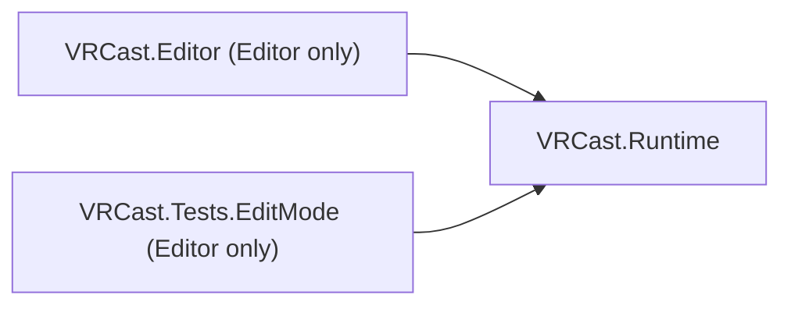

# Architecture

## 基本方針

- VRChat 用 Unity プロジェクトを Runtime として動かすのではなく、**アバターを必要なデータへ変換し、専用 Runtime で動かす**。
- Unity Editor は開発時・変換時にのみ使用し、完成した `VRCast.exe` には不要。
- アバターは信頼できない入力として扱い、**アバター = データ** とする（任意コードを実行しない）。

優先順位: アバターの可搬性 > Runtime の独立性 > 軽量性 > 安定したレンダリング > トラッキング > OBS 出力 > 高度な機能 > UI。

## 技術選定

| 項目 | 選定 | 理由 |
| :--- | :--- | :--- |
| Unity | 2022.3.22f1 | VRChat SDK と同一。AssetBundle は作成・読込で同一バージョンが必要 |
| Render Pipeline | Built-in | lilToon / Poiyomi 等 VRChat 向けシェーダーが Built-in 前提 |
| UI | IMGUI / UI Toolkit (標準モジュール) | 追加パッケージ不要 |
| 設定保存 | `JsonUtility` | 標準機能のみで完結 |

## Assembly 構成

| Assembly | 場所 | プラットフォーム | 参照 |
| :--- | :--- | :--- | :--- |
| `VRCast.Runtime` | `Assets/VRCast/Runtime` | 全て | なし |
| `VRCast.Editor` | `Assets/VRCast/Editor` | Editor のみ | `VRCast.Runtime` |
| `VRCast.Tests.EditMode` | `Assets/VRCast/Tests/EditMode` | Editor のみ | `VRCast.Runtime`, Test Framework |

### 依存ルール

- `VRCast.Runtime` は `UnityEditor`、`AssetDatabase`、VRChat SDK、VCC に依存しない。
  `AssemblyIsolationTests` が参照アセンブリを検査する。
- Editor 専用コードは必ず `VRCast.Editor`（または将来の Converter パッケージ）に置く。
- VRChat SDK への依存は Converter パッケージ（`com.vrcast.converter`、Milestone 7 予定）に限定する。
  Runtime プロジェクトには VRChat SDK を導入しない。
- 新しい Package を追加する場合は、理由と Runtime への影響をこのドキュメントに追記する。

## Runtime フォルダ構成

必要になった Milestone でフォルダを追加する（空フォルダは作らない）。

| フォルダ | 責務 | 追加時期 |
| :--- | :--- | :--- |
| `Core/` | ログ、設定、起動処理 | Milestone 0 (済) |
| `Avatar/` | `.vavatar` 読込・検証・生成 | Milestone 1 |
| `Camera/` | カメラ操作 | Milestone 1 |
| `Rendering/` | 背景透過、解像度、ライティング | Milestone 2 |
| `Animation/` | BlendShape、表情、Viseme | Milestone 3 |
| `Physics/` | PhysBone 相当 | Milestone 4 |
| `Tracking/` | Tracking Provider と Driver | Milestone 5 |
| `OSC/` | OSC 入出力 | Milestone 6 |
| `Output/` | Spout / NDI 等 | Milestone 8 |

## Core

| クラス | 責務 |
| :--- | :--- |
| `VRCastLog` | `Debug.Log` をカテゴリ付きで薄くラップ |
| `AppSettings` | 永続化する設定値（ウィンドウサイズ、背景色、最後に開いたアバター） |
| `SettingsStore` | `settings.json` の読込・保存。破損時は既定値にフォールバック |
| `AppBootstrap` | `RuntimeInitializeOnLoadMethod` で起動時に設定を読み込む |

## Editor

| クラス | 責務 |
| :--- | :--- |
| `VRCastBuild` | Windows x64 ビルド。`Main.unity` がなければ生成してビルド対象に登録 |

## Tests (EditMode)

| クラス | 検証内容 |
| :--- | :--- |
| `AssemblyIsolationTests` | `VRCast.Runtime` が `UnityEditor` / `VRCast.Editor` / VRChat SDK を参照していない（`#if UNITY_EDITOR` 内の参照も違反として検出する） |
| `SettingsStoreTests` | 設定の保存・再読込、ファイル欠落・破損時のフォールバック、値の補正 |
