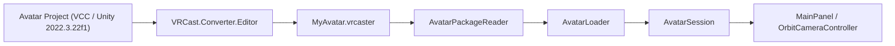
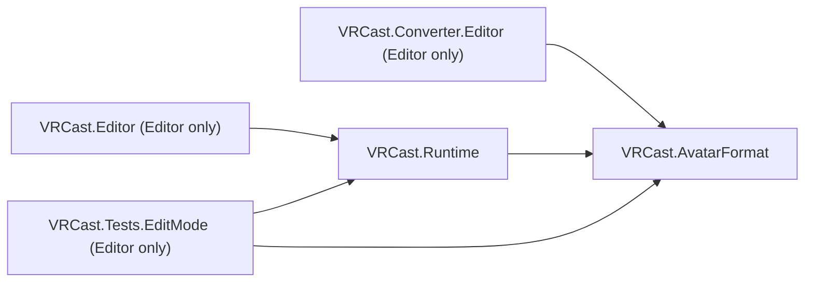

# Architecture

## 基本方針

- VRChat 用 Unity プロジェクトを Runtime として動かすのではなく、**アバターを必要なデータへ変換し、専用 Runtime で動かす**。
- Unity Editor は開発時・変換時にのみ使用し、完成した `VRCast.exe` には不要。
- アバターは信頼できない入力として扱い、**アバター = データ** とする（任意コードを実行しない）。

優先順位: アバターの可搬性 > Runtime の独立性 > 軽量性 > 安定したレンダリング > トラッキング > OBS 出力 > 高度な機能 > UI。

## 技術選定

| 項目 | 選定 | 理由 |
| :--- | :--- | :--- |
| Unity | 2022.3.22f1 | VRChat SDK と同一。AssetBundle は作成・読込で同一バージョンが必要 |
| Render Pipeline | Built-in | lilToon / Poiyomi 等 VRChat 向けシェーダーが Built-in 前提 |
| UI | IMGUI (標準モジュール) | 追加パッケージ不要。UI 作り込みは後回し |
| 入力 | Input Manager (旧) | 追加パッケージ不要 |
| 設定・manifest | `JsonUtility` | 標準機能のみで完結 |
| パッケージ | `System.IO.Compression.ZipArchive`（無圧縮格納） | .NET Standard 2.1 標準。Deflate を使わず展開負荷と依存を抑える |

## 全体構成

## Assembly 構成

| Assembly | 場所 | プラットフォーム | 参照 |
| :--- | :--- | :--- | :--- |
| `VRCast.AvatarFormat` | `Packages/com.vrcast.converter/Runtime` | 全て | なし |
| `VRCast.Converter.Editor` | `Packages/com.vrcast.converter/Editor` | Editor のみ | `VRCast.AvatarFormat` |
| `VRCast.Runtime` | `VRCast/Assets/VRCast/Runtime` | 全て | `VRCast.AvatarFormat` |
| `VRCast.Editor` | `VRCast/Assets/VRCast/Editor` | Editor のみ | `VRCast.Runtime` |
| `VRCast.Tests.EditMode` | `VRCast/Assets/VRCast/Tests/EditMode` | Editor のみ | `VRCast.Runtime`, `VRCast.AvatarFormat`, Test Framework |

### 依存ルール

- `VRCast.Runtime` と `VRCast.AvatarFormat` は `UnityEditor`、`AssetDatabase`、VRChat SDK、VCC に依存しない。
  `AssemblyIsolationTests` が参照アセンブリを検査する。
- Exporter と Runtime の共通定義（manifest、ファイル配置、許可コンポーネント、ハッシュ）は `VRCast.AvatarFormat` に置き、重複実装しない。
- VRChat SDK への依存は `VRCast.Converter.Editor` に限定する。現状はアセンブリ参照を持たず、リフレクションで型名・フィールド名から読む（SDK 無しでもコンパイル可能）。Runtime プロジェクトには VRChat SDK を導入しない。
- Runtime プロジェクトは `com.vrcast.converter` をローカルパス（`file:../../Packages/com.vrcast.converter`）で参照する。
- 新しい Package を追加する場合は、理由と Runtime への影響をこのドキュメントに追記する。
- 外部バイナリ: トラッキングは別プロセスのトラッカーを同梱して起動し、UDP（`127.0.0.1`）で受信する
  （推論で描画を止めない・トラッカーの異常終了が Runtime に波及しない）。どちらもリポジトリには含めずビルド前に配置する。
  - 既定: MediaPipe トラッカー（`Tools/MediaPipeTracker/vrcast_tracker.py`、MediaPipe は Apache-2.0）を PyInstaller で exe 化し、
    モデルと一緒に `StreamingAssets/MediaPipeTracker/` へ（`Tools/MediaPipeTracker/build.ps1`、ダブルクリック用 `build.bat`）。顔・腕・手を JSON で送る
  - 代替: OpenSeeFace（BSD-2-Clause）を `StreamingAssets/OpenSeeFace/` へ（顔のみ）
  - Unity 2022.3 では Unity 公式の推論パッケージ（Sentis）が使えず、MediaPipe の Unity プラグインは巨大なネイティブ依存になるため、
    Runtime へは組み込まない

### 名前空間

Unity の型名との衝突を避けるため、フォルダ・名前空間は複数形または別名にする
（`VRCast.Avatars`、`VRCast.Cameras`、`VRCast.Animations`、`VRCast.Dynamics`）。`VRCast.Avatar` / `VRCast.Camera` / `VRCast.Animation` / `VRCast.Physics` は
`UnityEngine.Avatar` / `UnityEngine.Camera` / `UnityEngine.Animation` / `UnityEngine.Physics` を隠すため使用しない。

## Runtime フォルダ構成

必要になった Milestone でフォルダを追加する（空フォルダは作らない）。

| フォルダ | 責務 | 追加時期 |
| :--- | :--- | :--- |
| `Core/` | ログ、設定、起動処理 | Milestone 0 (済) |
| `App/` | 起動時の各機能の生成と結線 | Milestone 1 (済) |
| `Avatars/` | `.vrcaster` 検証・展開・読込・生成 | Milestone 1 (済) |
| `Cameras/` | カメラ操作 | Milestone 1 (済) |
| `UI/` | IMGUI 操作パネル | Milestone 1 (済) |
| `Rendering/` | 背景透過、解像度、ライティング | Milestone 2 (済) |
| `Animations/` | 待機ポーズ、表情（BlendShape）、まばたき、リップシンク | Milestone 3 (済) |
| `Audio/` | マイク入力（音量） | Milestone 3 (済) |
| `Dynamics/` | PhysBone 相当（揺れもの）、Constraint | Milestone 4 / 7 (済) |
| `Tracking/` | Tracking Provider と Driver（顔・腕・手） | Milestone 5 (済) |
| `OSC/` | OSC 入出力 | Milestone 6 |
| `Output/` | Spout / NDI 等 | Milestone 8 |

## Core

| クラス | 責務 |
| :--- | :--- |
| `VRCastLog` | `Debug.Log` をカテゴリ付きで薄くラップ |
| `AppSettings` | 永続化する設定値（ウィンドウサイズ、最後に開いたアバター、背景透過・背景色、ライト強度・向き、待機ポーズの度合い、自動まばたき、揺れもの ON/OFF、リップシンク・マイク設定、トラッキングの ON/OFF・入力元（MediaPipe / OpenSeeFace）・ポート・鏡像・上半身の傾きと視線の強さ・腕と手の ON/OFF・トラッカーのパス・カメラ名） |
| `TrackingSource` | トラッキングの入力元（MediaPipe = 0 / OpenSeeFace = 1、設定に数値で保存） |
| `SettingsStore` | `settings.json` の読込・保存。破損時は既定値にフォールバック |
| `AppBootstrap` | `RuntimeInitializeOnLoadMethod` で起動時に設定を読み込み（初回は既定値で作成）、終了時にウィンドウサイズを含めて保存する |

## App / Avatars / Animations / Audio / Cameras / Rendering / UI

| クラス | 責務 |
| :--- | :--- |
| `AppRoot` | シーン読込後に `AvatarSession` / `OrbitCameraController` / `RenderingController` / `MicrophoneInput` / `TrackingReceiver` / `TrackerProcess` / `MainPanel` を生成して結線。読込完了時にアバターへ `PoseController` / `ExpressionController` / `BlinkController` / `LipSyncController` / `FaceTrackingDriver` / `HandTrackingDriver` / `ConstraintSolver` / `PhysBoneSimulator` を付与。起動引数 `--avatar` または前回のアバターを自動読込 |
| `AvatarPackageReader` | `.vrcaster` の構造・サイズ・manifest・ハッシュを検証し、bundle を `temporaryCachePath/avatars/<sha256>/` に展開。`metadata/*.json`（expressions / descriptor / physbones / constraints）を読み込み（不正なら空） |
| `AvatarLoader` | bundle を非同期読込してアバターを生成し、許可リスト外コンポーネントを除去 |
| `LoadedAvatar` | 生成済みアバターと bundle の組。`Dispose` で両方解放。フレーミング用境界（Humanoid は骨格基準、それ以外は Renderer 基準） |
| `AvatarSession` | 表示中アバター 1 体の Load / Reload / Unload と状態（読込中・エラー） |
| `OrbitCameraController` | 注視点中心の回転・パン・ズーム、境界の高さ・幅が収まる距離へのフレーミング、FOV |
| `RenderingController` | 背景（透過 = alpha 0 / 単色）、ウィンドウ解像度、ディレクショナルライトを設定値に従って適用 |
| `PoseController` | アバターの向き（Body yaw）と、Humanoid の待機ポーズ。読込時姿勢の筋肉値から肘の曲げだけを補間し、腕は上腕ボーンを真下（外側へ 12°）へ向けて回す。既定は気を付け（0 / 0 で元の姿勢を復元） |
| `ExpressionController` | 表情プリセットを BlendShape に適用。切替時は読込時の値へ戻してから適用。数字キー 1〜9 / 0 |
| `BlendShapeOverlay` | BlendShape の検索と、元の値（表情等）を保ったままの上乗せ書き込み |
| `BlinkController` | ランダム間隔の自動まばたき（ON/OFF 可）。外部入力（トラッキング、左右別）があればそちらを優先。両目用とウインク用 BlendShape の振り分け |
| `LipSyncController` | マイク音量と外部入力（トラッキング）の大きい方で Viseme `aa` または口開閉 BlendShape を上乗せ |
| `MicrophoneInput` | マイクのループ録音と音量（RMS、ゲート・感度・平滑化）。デバイス切替・切断時の再開 |
| `PhysBoneSimulator` | アバターの全 PhysBone を 60Hz 固定ステップで更新。ON/OFF、粒子数上限 |
| `PhysBoneChain` | 1 PhysBone の Verlet 近似（pull / spring / stiffness / gravity / immobile / 角度制限 / 長さ拘束）と Transform への回転反映 |
| `PhysBoneCollider` | 球・カプセル・平面コライダーによるボーン線分（半径付き）の押し出し |
| `ConstraintSolver` | アバターの全 Constraint をトラッキング適用後・揺れもの計算前（実行順 -50）に毎フレーム評価。参照関係で評価順を並べ替え。Humanoid ボーンと腰の親（Armature 等）を動かすものは対象外 |
| `ConstraintEvaluator` | 1 Constraint（Position / Rotation / Scale / Parent / Aim / LookAt）の評価。重み付き平均・オフセット・静止値・軸マスク・ローカル空間 |
| `IFaceTrackingProvider` / `FaceTrackingFrame` | フェイストラッキング入力元の共通インターフェースと 1 フレーム分の値 |
| `IBodyTrackingProvider` / `BodyTrackingFrame` / `ArmTrackingData` | 腕・手のトラッキング入力元の共通インターフェースと 1 フレーム分の値（本人の左右、肩・肘・手首と手の 21 点、カメラ基準の Unity 座標） |
| `OpenSeeFacePacket` | OpenSeeFace UDP パケット（1 顔 1785 バイト）の解析と座標変換 |
| `MediaPipePacket` | 同梱 MediaPipe トラッカーの JSON の解析（頭の変換行列・BlendShape 51 種 → 頭・目・口・視線、腕 6 点と可視度、左右の手 21 点）と座標変換 |
| `TrackingMath` | パケット解析共通の非有限値チェック、カメラ基準 → アバタールート基準の変換と回転の左右反転（Driver・確認表示で共通） |
| `TrackingSkeletonView` | Raw view: 受信値を平滑化せず GL の線で描く確認表示（腕・手の点、頭の向き、視線、目・口の開き）。表示中はカメラの cullingMask を 0 にしてアバターを映さず、アバターの腰の位置・向き・鏡像設定に合わせて描く |
| `TrackingReceiver` | `127.0.0.1` のみで UDP を受信する Provider（顔・腕手）。入力元に合わせて解析を切替。途絶検出・再 bind・受信 fps |
| `TrackerProcess` | 同梱（`StreamingAssets/MediaPipeTracker/` / `StreamingAssets/OpenSeeFace/`）または指定されたトラッカーの自動起動・再試行・停止、カメラ一覧（`-l 1`）の取得・解析、デバイス名 → 番号の解決。入力元・手の ON/OFF の変更で再起動。MediaPipe 版へは自分の PID（`--parent-pid`）を渡し、異常終了時もトラッカーを残さない |
| `FaceTrackingDriver` | 頭の向きを首・頭ボーンへ、頭の位置を背骨・胸の傾きへ、視線を目ボーンへ、まばたき（左右別）・口を `BlinkController` / `LipSyncController` へ適用。キャリブレーション・鏡像 |
| `HandTrackingDriver` | 腕（上腕・前腕）と手首・指 15 節を、子ボーンへの向きがトラッキングの点の向きに一致するよう回転。映っていない腕は待機ポーズへフェード、未使用時はボーンに触れない。鏡像 |
| `MainPanel` | IMGUI パネル（Avatar / Pose / Expressions / Face / Tracking / Camera / Rendering）。Tab で表示切替 |
| `AnimationSection` | MainPanel 内の Pose / Expressions セクション UI |
| `FaceSection` | MainPanel 内の Face / Physics セクション UI（PhysBone、Auto blink、Lip sync、マイク選択・感度・メーター） |
| `TrackingSection` | MainPanel 内の Tracking セクション UI（ON/OFF、入力元の切替、腕と手の ON/OFF と状態、カメラ選択・一覧更新・再起動、同梱版が無いときのトラッカーのパス、ポート、Mirror、Raw view と顔の数値、Reset pose（頭・上半身・目線）/ Reset gaze（目線のみ）、受信状態） |
| `AvatarComponentCache` | 表示中アバターのコンポーネントをアバター切替までキャッシュ |
| `RenderingSection` | MainPanel 内の Rendering セクション UI |
| `GuiControls` | セクション共通の IMGUI 部品（ラベル付きスライダー、`<` `>` の巡回選択） |
| `PathUtility` | 入力パスの整形（前後の空白・`"` を除去） |

## Converter (`com.vrcast.converter`)

| クラス | 責務 |
| :--- | :--- |
| `AvatarPackageLayout` | `.vrcaster` のエントリ名・フォーマットバージョン・Prefab パス |
| `AvatarManifest` | manifest.json のモデルと検証 |
| `AllowedComponents` | bundle に含めてよいコンポーネントの許可リスト |
| `HashUtility` | SHA-256 計算 |
| `IMetadata` | metadata モデル共通の検証インターフェース |
| `ExpressionSet` | `metadata/expressions.json` のモデルと検証（Runtime と共有） |
| `AvatarDescriptorData` | `metadata/descriptor.json`（リップシンク・まぶた）のモデルと検証 |
| `PhysBoneSet` | `metadata/physbones.json`（PhysBone・コライダー）のモデルと検証 |
| `PhysBoneExtractor` | `VRCPhysBone` / `VRCPhysBoneCollider` をリフレクションで読み PhysBoneSet へ変換 |
| `ConstraintSet` | `metadata/constraints.json`（Constraint とソース）のモデルと検証 |
| `ConstraintExtractor` | VRC Constraint（リフレクション）と Unity 標準 Constraint を ConstraintSet へ変換。アバター外のソース・範囲外の値は除外 |
| `ReflectionUtility` | SDK 型をアセンブリ参照なしで読むためのフィールド取得（float / bool / Vector3）・型名検索・アバタールートからの相対パス |
| `AvatarExporter` | 複製 → FX 既定状態の焼き込み・表情抽出 → 除去 → 一時 Prefab → AssetBundle → ZIP の書き出し |
| `ExpressionExtractor` | FX コントローラーから BlendShape のみのクリップを表情プリセットとして抽出 |
| `VrcDescriptorReader` | VRChat SDK 非依存（リフレクション）で `VRCAvatarDescriptor` の FX コントローラー、Expression Parameters 既定値、Lip Sync・Eyelids 設定を取得 |
| `FxDefaultStateBaker` | FX の各レイヤーで既定値により到達するステートのモーションから、表示 ON/OFF・BlendShape・マテリアル差し替えの 0 秒時点の値を複製へ適用 |
| `ComponentStripper` | 許可リスト外コンポーネント・Missing Script・EditorOnly オブジェクト・Animator Controller の除去 |
| `AvatarExporterWindow` | `VRCast > Avatar Exporter` ウィンドウ |

## Editor

| クラス | 責務 |
| :--- | :--- |
| `VRCastBuild` | Windows x64 ビルド。`Main.unity` がなければ生成してビルド対象に登録。同梱トラッカー（MediaPipe / OpenSeeFace）が未配置なら警告 |

## Tests (EditMode)

| クラス | 検証内容 |
| :--- | :--- |
| `AssemblyIsolationTests` | `VRCast.Runtime` / `VRCast.AvatarFormat` が `UnityEditor` / Editor アセンブリ / VRChat SDK を参照していない（`#if UNITY_EDITOR` 内の参照も違反として検出する） |
| `SettingsStoreTests` | 設定の保存・再読込、ファイル欠落・破損時のフォールバック、値の補正 |
| `TrackerProcessTests` | トラッカーのカメラ一覧出力の解析（見出し・CRLF・番号の欠け・無関係な出力）、入力元ごとの同梱版の探索 |
| `OpenSeeFacePacketTests` | OpenSeeFace パケットの値の位置・四元数の座標変換・長さ不足・非有限値・長さ 0 四元数の拒否 |
| `MediaPipePacketTests` | MediaPipe JSON の頭の位置・回転の座標変換、目（左右入れ替え）・口・視線の BlendShape 割り当て、腕・手の左右入れ替えと可視度判定と x・y 反転、片手のみ、壊れた顔の部分無効化、バージョン不一致・不正 JSON の拒否 |
| `AvatarPackageReaderTests` | 正常展開、キャッシュ再利用、ハッシュ不一致・manifest 欠落・未対応バージョン・パストラバーサル・非 ZIP の拒否、エントリ名判定、表情・descriptor・physbones・constraints データの読込・不正時の空扱い |
| `ConstraintEvaluatorTests` | Constraint の重み付き平均・軸マスク・重み 0 の静止値・無効時の非適用・Parent のオフセット・Aim / LookAt の向き・評価順の並べ替え・検証 |
