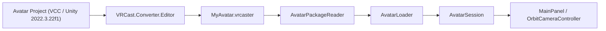
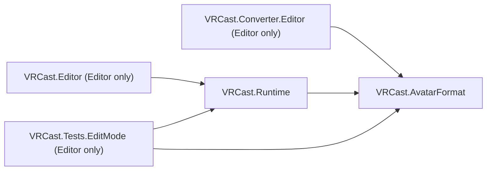

# Architecture

## 基本方針

- VRChat 用 Unity プロジェクトを Runtime として動かすのではなく、**アバターを必要なデータへ変換し、専用 Runtime で動かす**。
- Unity Editor は開発時・変換時にのみ使用し、完成した `VRCast.exe` には不要。
- アバターは信頼できない入力として扱い、**アバター = データ** とする（任意コードを実行しない）。

優先順位: アバターの可搬性 > Runtime の独立性 > 軽量性 > 安定したレンダリング > トラッキング > OBS 出力 > 高度な機能 > UI。

## 技術選定

| 項目 | 選定 | 理由 |
| :--- | :--- | :--- |
| Unity | 2022.3.22f1 | VRChat SDK と同一。AssetBundle は作成・読込で同一バージョンが必要 |
| Render Pipeline | Built-in | lilToon / Poiyomi 等 VRChat 向けシェーダーが Built-in 前提 |
| UI | IMGUI (標準モジュール) | 追加パッケージ不要。UI 作り込みは後回し |
| 入力 | Input Manager (旧) | 追加パッケージ不要 |
| 設定・manifest | `JsonUtility` | 標準機能のみで完結 |
| パッケージ | `System.IO.Compression.ZipArchive`（無圧縮格納） | .NET Standard 2.1 標準。Deflate を使わず展開負荷と依存を抑える |

## 全体構成

## Assembly 構成

| Assembly | 場所 | プラットフォーム | 参照 |
| :--- | :--- | :--- | :--- |
| `VRCast.AvatarFormat` | `Packages/com.vrcast.converter/Runtime` | 全て | なし |
| `VRCast.Converter.Editor` | `Packages/com.vrcast.converter/Editor` | Editor のみ | `VRCast.AvatarFormat` |
| `VRCast.Runtime` | `VRCast/Assets/VRCast/Runtime` | 全て | `VRCast.AvatarFormat` |
| `VRCast.Editor` | `VRCast/Assets/VRCast/Editor` | Editor のみ | `VRCast.Runtime` |
| `VRCast.Tests.EditMode` | `VRCast/Assets/VRCast/Tests/EditMode` | Editor のみ | `VRCast.Runtime`, `VRCast.AvatarFormat`, Test Framework |

### 依存ルール

- `VRCast.Runtime` と `VRCast.AvatarFormat` は `UnityEditor`、`AssetDatabase`、VRChat SDK、VCC に依存しない。
  `AssemblyIsolationTests` が参照アセンブリを検査する。
- Exporter と Runtime の共通定義（manifest、ファイル配置、許可コンポーネント、ハッシュ）は `VRCast.AvatarFormat` に置き、重複実装しない。
- VRChat SDK への依存は `VRCast.Converter.Editor` に限定する（Milestone 7 で導入予定）。Runtime プロジェクトには VRChat SDK を導入しない。
- Runtime プロジェクトは `com.vrcast.converter` をローカルパス（`file:../../Packages/com.vrcast.converter`）で参照する。
- 新しい Package を追加する場合は、理由と Runtime への影響をこのドキュメントに追記する。

### 名前空間

Unity の型名との衝突を避けるため、フォルダ・名前空間は複数形または別名にする
（`VRCast.Avatars`、`VRCast.Cameras`）。`VRCast.Avatar` / `VRCast.Camera` は `UnityEngine.Avatar` / `UnityEngine.Camera` を隠すため使用しない。

## Runtime フォルダ構成

必要になった Milestone でフォルダを追加する（空フォルダは作らない）。

| フォルダ | 責務 | 追加時期 |
| :--- | :--- | :--- |
| `Core/` | ログ、設定、起動処理 | Milestone 0 (済) |
| `App/` | 起動時の各機能の生成と結線 | Milestone 1 (済) |
| `Avatars/` | `.vrcaster` 検証・展開・読込・生成 | Milestone 1 (済) |
| `Cameras/` | カメラ操作 | Milestone 1 (済) |
| `UI/` | IMGUI 操作パネル | Milestone 1 (済) |
| `Rendering/` | 背景透過、解像度、ライティング | Milestone 2 |
| `Animation/` | BlendShape、表情、Viseme | Milestone 3 |
| `Physics/` | PhysBone 相当 | Milestone 4 |
| `Tracking/` | Tracking Provider と Driver | Milestone 5 |
| `OSC/` | OSC 入出力 | Milestone 6 |
| `Output/` | Spout / NDI 等 | Milestone 8 |

## Core

| クラス | 責務 |
| :--- | :--- |
| `VRCastLog` | `Debug.Log` をカテゴリ付きで薄くラップ |
| `AppSettings` | 永続化する設定値（ウィンドウサイズ、背景色、最後に開いたアバター） |
| `SettingsStore` | `settings.json` の読込・保存。破損時は既定値にフォールバック |
| `AppBootstrap` | `RuntimeInitializeOnLoadMethod` で起動時に設定を読み込み（初回は既定値で作成）、終了時に保存する |

## App / Avatars / Cameras / UI

| クラス | 責務 |
| :--- | :--- |
| `AppRoot` | シーン読込後に `AvatarSession` / `OrbitCameraController` / `MainPanel` を生成して結線。起動引数 `--avatar` または前回のアバターを自動読込 |
| `AvatarPackageReader` | `.vrcaster` の構造・サイズ・manifest・ハッシュを検証し、bundle を `temporaryCachePath/avatars/<sha256>/` に展開 |
| `AvatarLoader` | bundle を非同期読込してアバターを生成し、許可リスト外コンポーネントを除去 |
| `LoadedAvatar` | 生成済みアバターと bundle の組。`Dispose` で両方解放 |
| `AvatarSession` | 表示中アバター 1 体の Load / Reload / Unload と状態（読込中・エラー） |
| `OrbitCameraController` | 注視点中心の回転・パン・ズーム、アバター全体へのフレーミング、FOV |
| `MainPanel` | IMGUI パネル（Avatar / Camera）。Tab で表示切替 |

## Converter (`com.vrcast.converter`)

| クラス | 責務 |
| :--- | :--- |
| `AvatarPackageLayout` | `.vrcaster` のエントリ名・フォーマットバージョン・Prefab パス |
| `AvatarManifest` | manifest.json のモデルと検証 |
| `AllowedComponents` | bundle に含めてよいコンポーネントの許可リスト |
| `HashUtility` | SHA-256 計算 |
| `AvatarExporter` | 複製 → 除去 → 一時 Prefab → AssetBundle → ZIP の書き出し |
| `ComponentStripper` | 許可リスト外コンポーネント・Missing Script・EditorOnly オブジェクト・Animator Controller の除去 |
| `AvatarExporterWindow` | `VRCast > Avatar Exporter` ウィンドウ |

## Editor

| クラス | 責務 |
| :--- | :--- |
| `VRCastBuild` | Windows x64 ビルド。`Main.unity` がなければ生成してビルド対象に登録 |

## Tests (EditMode)

| クラス | 検証内容 |
| :--- | :--- |
| `AssemblyIsolationTests` | `VRCast.Runtime` / `VRCast.AvatarFormat` が `UnityEditor` / Editor アセンブリ / VRChat SDK を参照していない（`#if UNITY_EDITOR` 内の参照も違反として検出する） |
| `SettingsStoreTests` | 設定の保存・再読込、ファイル欠落・破損時のフォールバック、値の補正 |
| `AvatarPackageReaderTests` | 正常展開、キャッシュ再利用、ハッシュ不一致・manifest 欠落・未対応バージョン・パストラバーサル・非 ZIP の拒否、エントリ名判定 |
