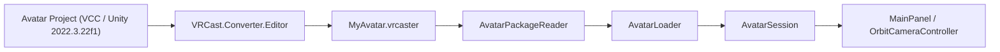
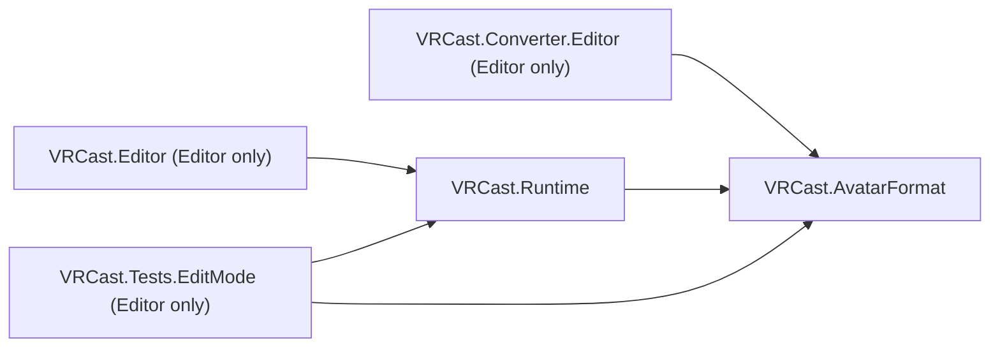

# Architecture

## 基本方針

- VRChat 用 Unity プロジェクトを Runtime として動かすのではなく、**アバターを必要なデータへ変換し、専用 Runtime で動かす**。
- Unity Editor は開発時・変換時にのみ使用し、完成した `VRCast.exe` には不要。
- アバターは信頼できない入力として扱い、**アバター = データ** とする（任意コードを実行しない）。

優先順位: アバターの可搬性 > Runtime の独立性 > 軽量性 > 安定したレンダリング > トラッキング > OBS 出力 > 高度な機能 > UI。

## 技術選定

| 項目 | 選定 | 理由 |
| :--- | :--- | :--- |
| Unity（書き出し側） | 2022.3.22f1 | VRChat SDK と同一（アバターのプロジェクトで使う） |
| Unity（VRCast 本体） | 2022.3 LTS の最新版（2022.3.62f3 以降） | AssetBundle は同じ系列（2022.3）なら読める。Unity 6 などの別系列はシェーダーの互換が保証されないため使わない。スクリプトは IL2CPP（CPU 負荷を下げ、Mono のランタイムを同梱しない） |
| Render Pipeline | Built-in | lilToon / Poiyomi 等 VRChat 向けシェーダーが Built-in 前提 |
| UI | IMGUI (標準モジュール) | 追加パッケージ不要。UI 作り込みは後回し |
| 入力 | Input Manager (旧) | 追加パッケージ不要 |
| 設定・manifest | `JsonUtility` | 標準機能のみで完結 |
| パッケージ | `System.IO.Compression.ZipArchive`（無圧縮格納） | .NET Standard 2.1 標準。Deflate を使わず展開負荷と依存を抑える |

## 全体構成

## Assembly 構成

| Assembly | 場所 | プラットフォーム | 参照 |
| :--- | :--- | :--- | :--- |
| `VRCast.AvatarFormat` | `Packages/com.vrcast.converter/Runtime` | 全て | なし |
| `VRCast.Converter.Editor` | `Packages/com.vrcast.converter/Editor` | Editor のみ | `VRCast.AvatarFormat` |
| `VRCast.Runtime` | `VRCast/Assets/VRCast/Runtime` | 全て | `VRCast.AvatarFormat` |
| `VRCast.Editor` | `VRCast/Assets/VRCast/Editor` | Editor のみ | `VRCast.Runtime` |
| `VRCast.Tests.EditMode` | `VRCast/Assets/VRCast/Tests/EditMode` | Editor のみ | `VRCast.Runtime`, `VRCast.AvatarFormat`, Test Framework |

### 依存ルール

- `VRCast.Runtime` と `VRCast.AvatarFormat` は `UnityEditor`、`AssetDatabase`、VRChat SDK、VCC に依存しない。
  `AssemblyIsolationTests` が参照アセンブリを検査する。
- Exporter と Runtime の共通定義（manifest、ファイル配置、許可コンポーネント、ハッシュ）は `VRCast.AvatarFormat` に置き、重複実装しない。
- VRChat SDK への依存は `VRCast.Converter.Editor` に限定する。現状はアセンブリ参照を持たず、リフレクションで型名・フィールド名から読む（SDK 無しでもコンパイル可能）。Runtime プロジェクトには VRChat SDK を導入しない。
- Runtime プロジェクトは `com.vrcast.converter` をローカルパス（`file:../../Packages/com.vrcast.converter`）で参照する。
- 新しい Package を追加する場合は、理由と Runtime への影響をこのドキュメントに追記する。
- 外部バイナリ: トラッキングは別プロセスのトラッカーを同梱して起動し、UDP（`127.0.0.1`）で受信する
  （推論で描画を止めない・トラッカーの異常終了が Runtime に波及しない）。どちらもリポジトリには含めずビルド前に配置する。
  - 既定: MediaPipe トラッカー（`Tools/MediaPipeTracker/vrcast_tracker.py`、MediaPipe は Apache-2.0）を PyInstaller で exe 化し、
    モデルと一緒に `VRCast/Trackers/MediaPipeTracker/` へ（ビルド後に `StreamingAssets/` へコピー）（`Tools/MediaPipeTracker/build.ps1`、ダブルクリック用 `build.bat`）。顔・腕・手を JSON で送る（頭・腕・手・可視度は送信前に One Euro フィルターで平滑化）
  - 代替: OpenSeeFace（BSD-2-Clause）を `VRCast/Trackers/OpenSeeFace/` へ（顔のみ、ビルド後に `StreamingAssets/` へコピー）
  - トラッカーは `Assets/` の外に置く（DLL 群が Unity のネイティブプラグインとして登録され、エディターのスクリプトコンパイルが失敗するため）
  - Unity 2022.3 では Unity 公式の推論パッケージ（Sentis）が使えず、MediaPipe の Unity プラグインは巨大なネイティブ依存になるため、
    Runtime へは組み込まない

### 名前空間

Unity の型名との衝突を避けるため、フォルダ・名前空間は複数形または別名にする
（`VRCast.Avatars`、`VRCast.Cameras`、`VRCast.Animations`、`VRCast.Dynamics`）。`VRCast.Avatar` / `VRCast.Camera` / `VRCast.Animation` / `VRCast.Physics` は
`UnityEngine.Avatar` / `UnityEngine.Camera` / `UnityEngine.Animation` / `UnityEngine.Physics` を隠すため使用しない。

## Runtime フォルダ構成

必要になった Milestone でフォルダを追加する（空フォルダは作らない）。

| フォルダ | 責務 | 追加時期 |
| :--- | :--- | :--- |
| `Core/` | ログ、設定、起動処理 | Milestone 0 (済) |
| `App/` | 起動時の各機能の生成と結線 | Milestone 1 (済) |
| `Avatars/` | `.vrcaster` 検証・展開・読込・生成 | Milestone 1 (済) |
| `Cameras/` | カメラ操作 | Milestone 1 (済) |
| `UI/` | IMGUI 操作パネル | Milestone 1 (済) |
| `Rendering/` | 背景透過、解像度、ライティング | Milestone 2 (済) |
| `Animations/` | 待機ポーズ、表情（BlendShape）、まばたき、リップシンク | Milestone 3 (済) |
| `Audio/` | マイク入力（音量） | Milestone 3 (済) |
| `Dynamics/` | PhysBone 相当（揺れもの）、Constraint | Milestone 4 / 7 (済) |
| `Tracking/` | Tracking Provider と Driver（顔・腕・手） | Milestone 5 (済) |
| `OSC/` | OSC 入出力 | Milestone 6 |
| `Output/` | 仮想カメラ出力（UnityCapture） | Milestone 8 (仮想カメラ済) |
| `Platform/` | OS 機能（ウィンドウへのファイルのドロップ、ファイル選択ダイアログ。Win32 P/Invoke） | 操作パネルの刷新 (済) |

## Core

| クラス | 責務 |
| :--- | :--- |
| `VRCastLog` | `Debug.Log` をカテゴリ付きで薄くラップ |
| `LogBuffer` | Debug log タブ用に、`Application.logMessageReceivedThreaded`（`SubsystemRegistration` で登録）で全スレッドのログを最大 2000 件の環状バッファに保持。`[VRCast][Category]` はカテゴリと本文に分け、それ以外は `Unity` カテゴリ。スタックトレースはエラーのみ保持。`Add` で Player.log に書かないログ（トラッカーの出力 `TrackerOutput`）も追加できる。`Version` で UI が変化を検出。重要度は DEBUG / INFO / WARN / ERROR で、DEBUG は `DetailEnabled`（設定 `detailedLogging`）の間だけ記録（`VRCastLog.Detail`）。直前と同じ内容は 1 件にまとめて `Count` を増やす。配布版では通常ログ・警告のスタックトレース取得を止める |
| `AppSettings` | 永続化する設定値（ウィンドウサイズ、最後に開いたアバター、背景透過・背景色（既定ベージュ）、仮想カメラの ON/OFF と方式（Windows 11 の Media Foundation を使うか）、ライト強度・向き・色温度・環境光・アバターの明るさ、待機ポーズの度合い、待機モーション（呼吸・体の揺れ・頭のゆらぎの ON/OFF・強さ・速さ）、自動まばたき・表情中のまばたき停止、揺れもの ON/OFF、リップシンク・マイク設定・母音の口の形と声の高さ補正・表情中の口の停止（マイク・トラッキング別）、トラッキングの ON/OFF・入力元（MediaPipe / OpenSeeFace）・ポート・鏡像・体の動かし方と強さ・視線の強さ・まばたきのトラッキングの ON/OFF・腕と手の ON/OFF・トラッカーのパス・カメラ名、表示言語・UI の大きさ・ダークモード・軽量モード・プロセスの優先度・X3D でキャッシュの無い側のコアで動かすか・P コア / E コアの選択（`HybridCoreSelection`）・描画に使う GPU（優先設定と直接指定の GPU 名）・アップデート確認の ON/OFF）。`ResetToDefaults` で同じインスタンスのまま既定値へ戻す（ウィンドウサイズ・最後のアバターは保持） |
| `UiLanguage` | 操作パネルの表示言語（Auto = 0: OS に合わせる / English = 1 / Japanese = 2 / Korean = 3 / ChineseSimplified = 4 / ChineseTraditional = 5、設定に数値で保存するため並びは変えない） |
| `TrackingSource` | トラッキングの入力元（MediaPipe = 0 / OpenSeeFace = 1、設定に数値で保存） |
| `BodyMotion` | 頭の位置に合わせた体の動かし方（Lean = 0: 足を固定して背骨・胸を傾ける / Move = 1: 腰ごと移動 / LeanAndMove = 2、設定に数値で保存） |
| `SettingsStore` | `settings.json` の読込・保存。破損時は既定値にフォールバック |
| `VersionUtility` | "1.2.0" 形式（先頭の v 可、欠けた桁は 0）のバージョン番号の解析と比較。読めない番号は「新しくない」扱い |
| `AppBootstrap` | `RuntimeInitializeOnLoadMethod` で起動時に設定を読み込み（初回は既定値で作成）、終了時にウィンドウサイズを含めて保存する |

## App / Avatars / Animations / Audio / Cameras / Rendering / Output / UI

| クラス | 責務 |
| :--- | :--- |
| `AppRoot` | シーン読込後に `AvatarSession` / `OrbitCameraController` / `RenderingController` / `ProcessTuner` / `VirtualCameraOutput` / `SpoutOutput` / `MicrophoneInput` / `TrackingReceiver` / `TrackingSkeletonView` / `TrackerProcess` / `FileDropReceiver` / `RemoteControl` / `MainPanel` を生成して結線。読込完了時にアバターへ `PoseController` / `BlendShapeLimiter` / `ExpressionController` / `BlinkController` / `LipSyncController` / `FaceTrackingDriver` / `HandTrackingDriver` / `IdleMotionController` / `ConstraintSolver` / `PhysBoneSimulator` を付与。起動引数 `--avatar` または前回のアバターを自動読込。Windows ビルドではウィンドウのタイトルを「VRCast バージョン」に変更（`productName` は保存先フォルダに使われるため変えない） |
| `AvatarPackageReader` | `.vrcaster` の構造・サイズ・manifest・ハッシュを検証し、bundle を `temporaryCachePath/avatars/<sha256>/` に展開。`metadata/*.json`（expressions / descriptor / physbones / constraints）を読み込み（不正なら空） |
| `AvatarLoader` | bundle を非同期読込してアバターを生成し、許可リスト外コンポーネントを除去 |
| `LoadedAvatar` | 生成済みアバターと bundle の組。`Dispose` で両方解放。フレーミング用境界（Humanoid は骨格基準、それ以外は Renderer 基準） |
| `AvatarSession` | 表示中アバター 1 体の Load / Reload / Unload と状態（読込中・エラー） |
| `OrbitCameraController` | 注視点中心の回転・パン・ズーム、境界の高さ・幅が収まる距離へのフレーミング、FOV。視点（`CameraPose`: 注視点・距離・向き・画角）の取得と適用（`Pose` / `SetPose`。Reset の戻り先は変えない） |
| `CameraPose` / `AvatarLook` / `AvatarEntry` / `BlendShapeLimit` | アバターごとのカメラの視点と見た目（ライト・アバターの明るさ・待機ポーズ・体の向き）、BlendShape の上限（上限を付けたものだけ、パス + 名前 + 最大値）。`AppSettings.avatarCameras`（以前の設定ファイルとの互換のため名前据え置き）に `.vrcaster` のパス（大文字・小文字を区別しない）をキーとして保存し、使うたびに末尾へ移して最近使った 50 体分まで保持。新しい順の先頭 10 件を Avatar タブの「最近使ったアバター」に表示（× で記録ごと削除）。`AppRoot` がアバター読込時に、見た目 → 画角 → フレーミング → 保存済みの視点の順に戻し、以降は変わったときだけ記録（読込中・アンロード後は記録しない）。見た目が未記録のアバターは読込時の設定をそのまま使う。全設定のリセットでは消さない |
| `RenderingController` | 描画のフレームレート（VSync を止めて上限を明示。通常 60fps / 軽量モード 30fps）、ダークモードの切り替え（背景色が切り替え前のテーマの既定色のときだけ新しいテーマの既定色へ）、背景（非透過 = 背景色、透過 = 背景色 + alpha 0。ウィンドウ表示は alpha を無視し、ゲームキャプチャは alpha で抜くため OBS には映らない）、パネルを隠している間は設定に関係なく透過（`ForceTransparent`、保存しない）、ウィンドウ解像度、太陽光（ディレクショナルライトの強さ・色温度・向き。向きはカメラ正面基準）、環境光（ライティングデータを焼かないため `RenderSettings` の単色環境光と SH を直接設定）、ライティングのプリセット（`LightingPreset`）、アバターの明るさ（`AvatarMaterials` 経由）を設定値に従って適用 |
| `AvatarMaterials` | 表示中アバターのマテリアルの主色（`_Color` / `_BaseColor`）に Linear で倍率を掛ける（lilToon 等の明るさ上限を超えて明るくする）。読み込み時にシェーダーごとのマテリアル数と lilToon の明るさ関連の値をログに出す |
| `VirtualCameraOutput` | メインカメラの描画結果（操作パネルは含まない）を仮想カメラへ送る。方式は `UnityCapturePlugin.dll` 経由の「VRCast Camera」（DirectShow）と、設定 `virtualCameraMediaFoundation`（Windows 11 以降のみ有効）で選ぶ `MediaFoundationCamera` の「VRCast Camera (MF)」。方式が変わったら（切り替え・全設定のリセット）前の方式を閉じて開始からやり直す。Media Foundation 版の作成に失敗したら 5 秒ごとに作り直す（ドライバーを登録すると始まる）。ドライバーの登録・解除（`RunDriverAsync`）は使用中の方式に振り分け、Media Foundation 版は自分のカメラを消してから行う。無効時はコンポーネントごと止めて描画コストを増やさない。送信結果を状態（`VirtualCameraState`: 停止・開始中・送信中・受け取る側待ち・エラー）と英語の説明に変換し、エラーのみログ |
| `MediaFoundationCamera` | Windows 11 の Media Foundation 仮想カメラ（`Tools/VirtualCamera` でビルドする `VRCastVirtualCamera.dll`）への送信。`MFCreateVirtualCamera`（セッション単位・現在のユーザー）でカメラを作り、描画結果を 1920x1080 の BGRA32（sRGB）へ写して 30fps まで `AsyncGPUReadback` で読み戻し、DLL 経由で共有メモリへ書く。DLL の有無・対応 OS・DLL のパス（登録時のコピー元）は初回だけ調べる |
| `VRCastVirtualCamera.dll`（C++、`Tools/VirtualCamera/src`） | Frame Server が読み込むメディアソース（`Activator` → `MediaSource` → `MediaStream` 1 本、NV12 / RGB32 の 1080p・720p、30fps）と、VRCast から呼ぶ関数（`VRCastVCam_Start` / `Stop` / `Send` / `IsSupported` / `GetModulePath`）。共有メモリ（`Global\VRCastVirtualCameraFrame`、作れなければ `Local\`）はストリーム開始時にサービス側が作り、対話ユーザーにも書き込みを許す。送る側は受け取る側が 3 秒読まなければ閉じ、受け取る側は送る側が 3 秒書かなければ黒を出す |
| `SpoutOutput` | メインカメラの描画結果を Spout2 の送信元「VRCast」として共有する（OBS の Spout2 Capture 等で受信）。KlakSpout（Unlicense）のネイティブプラグイン `KlakSpout.dll` を直接呼び（`CreateSender` と描画イベント `UpdateSender` / `CloseSender`）、C# 側のパッケージは使わない。描画結果を同じ大きさの ARGB32 テクスチャへ写して送る（大きさが変わったら送信元を作り直す）。イベントデータはネイティブメモリに置き、閉じた後は数フレーム待ってから解放。Direct3D 11 / 12 以外・DLL 無しは状態表示とログを出して停止 |
| `VirtualCameraInstaller` | 同梱ドライバー（`StreamingAssets/UnityCapture` の 32 / 64 bit フィルター）の検出、レジストリ（64 bit フィルターの CLSID）からの登録状態の判定、`regsvr32` の管理者実行による登録（デバイス名指定）・解除。Media Foundation 版は `VRCastVirtualCamera.dll` を `Program Files\VRCast\VirtualCamera` へコピーして登録（Frame Server のサービスはユーザーのフォルダを読めない）、解除は登録を外してコピーを削除。使用中で上書き・削除できないときだけ Frame Server を止めてやり直す。どちらも終了コードに加えてレジストリで結果を確かめる |
| `PoseController` | アバターの向き（Body yaw）と、Humanoid の待機ポーズ。読込時姿勢の筋肉値から肘の曲げだけを補間し、腕は上腕ボーンを真下（外側へ 12°）へ向けて回す。既定は気を付け（0 / 0 で元の姿勢を復元）。`Reapply` で設定値から反映し直す |
| `IdleMotionController` | 待機モーション（呼吸・体の揺れ・頭のゆらぎ、既定 ON）。Humanoid の背骨・胸・上胸・肩・首・頭をアバタールート基準で少しだけ回して上乗せ（揺れ・ひねりは上半身で等分、呼吸は胸の反りと肩の上げ、上半身の傾きの 6 割を首で打ち消す）。前フレームの上乗せは、ボーンが書いたままなら外し、他（待機ポーズの変更・トラッキング）が書き直していればその回転を新しい基準にする。ON/OFF と顔のトラッキングの開始・終了は 0.5 秒で出し入れし（トラッキング中は頭のゆらぎを止める）、止まり切った後はボーンを触らない。実行順 -95（`FaceTrackingDriver` の後、`HandTrackingDriver`・Constraint・揺れものの前） |
| `IdleMotion` | 待機モーションの角度を時刻と強さから求める状態の無い計算（呼吸 4.5 秒で吸う 4 割・吐く 6 割、揺れ 9 秒 + 小さい波、ひねり 13 秒、頭は Perlin ノイズ。強さ 1 で 1〜2 度） |
| `ExpressionController` | 表情プリセットを BlendShape に適用。切替時は前の表情から次の表情へ 0.2 秒かけてモーフィング（プリセットに無い BlendShape は読込時の値へ。変化中のフレームだけ書き込むので、まばたき・口パクの上乗せと両立）。表情ごとのショートカットキー（`KeyCombo`。ニュートラル含む、既定は未割り当て、1 組み合わせ 1 表情、押した瞬間だけ反応。前面のとき、または背面でも使う設定のときに `GlobalKeyboard` で判定。割り当て中は `SuspendHotkeys` で止め、Tab のパネル切替も止める）。手動の選択（ボタン・キー・外部操作）は `Select` で固定（`IsManual`）し、トラッキングの自動検出で上書きしない。`toggle` 付きで固定中の同じ表情を選ぶか `ReleaseManual` / `ResetToNeutral` で固定を外す |
| `ExpressionMapping` | 検出した表情（笑顔・驚き・怒り・悲しみ・ウインク・ジト目・ふくれっ面）→ 表情プリセットの対応付け。設定に保存したプリセット名（空欄 = 自動、`<none>` = 割り当てなし）で解決し、無ければプリセット名のキーワードで推定。割り当て先がある表情のビット列（`Candidates`）も求める。表情ごとのしきい値の読み書き（未設定なら共通の `trackingExpressionThreshold`） |
| `BlendShapeOverlay` | BlendShape の検索と、元の値（表情等）を保ったままの上乗せ書き込み（`BlendShapeLimiter` の上限で切って書き、上限で切った固定の値は切る前の値を元の値として読む） |
| `BlendShapeLimiter` | アバターごとの BlendShape の上限。読込時に全 `SkinnedMeshRenderer` の BlendShape を列挙し、記録済みの上限（パス + 名前）を当てる。表情・まばたき等より先に初期化し、`BlendShapeOverlay` の生成（まばたき・口パク・パーフェクトシンク）と `ExpressionController` の対象解決が `MarkFace` で「顔」として登録する（一覧の区分だけで、上限の効き方は同じ）。`BlendShapeOverlay` と `ExpressionController` は書き込む前に `Limit` を通す。どの処理も書かない固定の値は LateUpdate の最後（実行順 10000）に上限で切り、上限を緩めると切る前の値へ戻す。表示中のアバターの分だけを静的に参照する |
| `BlinkController` | ランダム間隔の自動まばたき（ON/OFF 可）。外部入力（トラッキング、左右別）があればそちらを優先。設定により表情（`ExpressionController.Current`）中はどちらも止める。止めていた後（表情・外部入力・OFF）は再開時点から次のまばたきを予約し直す（止めている間に過ぎた予定ですぐ閉じない）。両目用とウインク用 BlendShape の振り分け |
| `LipSyncController` | マイク音量 × 母音の重みを Viseme `aa` / `ih` / `ou` / `E` / `oh`（同名の BlendShape はまとめる、無い母音は `aa` で代用）へ、JawFlap 方式は口開閉 BlendShape へ上乗せ。外部入力（トラッキングの口の開き）はマイク音量と大きい方を開き具合に使い、声が出ている間はマイクの母音で配る（無音なら `aa`）。設定により表情（`ExpressionController.Current`）中はマイク分・外部入力分をそれぞれ止める |
| `MicrophoneInput` | マイクのループ録音と音量（RMS、ゲート・感度・平滑化）、声が出ている間の母音推定（`VowelAnalyzer`）と重みの平滑化。デバイス切替・切断時の再開 |
| `VowelAnalyzer` | 約 11kHz へ間引き → 高域強調・ハミング窓 → LPC（12 次、Levinson-Durbin）の包絡から F1 / F2 を求め、母音（あいうえお）の代表値との対数周波数の距離で重み（合計 1）を出す。声の高さ補正は代表値に掛ける倍率 |
| `PhysBoneSimulator` | アバターの全 PhysBone を 60Hz 固定ステップで更新。ON/OFF、粒子数上限 |
| `PhysBoneChain` | 1 PhysBone の Verlet 近似（pull / spring / stiffness / gravity / immobile / 角度制限 / 長さ拘束）と Transform への回転反映 |
| `PhysBoneCollider` | 球・カプセル・平面コライダーによるボーン線分（半径付き）の押し出し |
| `ConstraintSolver` | アバターの全 Constraint をトラッキング適用後・揺れもの計算前（実行順 -50）に毎フレーム評価。参照関係で評価順を並べ替え。Humanoid ボーンと腰の親（Armature 等）を動かすものは対象外 |
| `ConstraintEvaluator` | 1 Constraint（Position / Rotation / Scale / Parent / Aim / LookAt）の評価。重み付き平均・オフセット・静止値・軸マスク・ローカル空間 |
| `IFaceTrackingProvider` / `FaceTrackingFrame` | フェイストラッキング入力元の共通インターフェースと 1 フレーム分の値（表情の強さ `ExpressionScores` は MediaPipe のみ） |
| `ExpressionDetector` | 表情の強さから今の表情を 1 つに決める（割り当て先がある表情だけを候補にする、入る / 抜けるしきい値のヒステリシス、0.3 秒の保持、口を開けている間は笑顔のしきい値を上げる。入るしきい値は表情ごとの設定値（0.1〜0.8、表情の強さと同じ目盛り）、抜けるしきい値はその 0.65 倍） |
| `IBodyTrackingProvider` / `BodyTrackingFrame` / `ArmTrackingData` | 腕・手のトラッキング入力元の共通インターフェースと 1 フレーム分の値（本人の左右、肩・肘・手首と手の 21 点、カメラ基準の Unity 座標） |
| `OpenSeeFacePacket` | OpenSeeFace UDP パケット（1 顔 1785 バイト）の解析と座標変換 |
| `MediaPipePacket` | 同梱 MediaPipe トラッカーの JSON の解析（頭の変換行列・BlendShape 51 種 → 頭・目・口・視線・表情の強さ（笑顔 = 口角、怒り = 眉下げ、驚き = 眉全体の上げ、悲しみ = 口角下げ + 眉の内側だけの上げ、ウインク = 左右のまばたきの差、ジト目 = 両目の半閉じ（下向きの視線で弱める）、ふくれっ面 = mouthPucker）、腕 6 点と可視度、左右の手 21 点）と座標変換 |
| `TrackingMath` | パケット解析共通の非有限値チェック、カメラ基準 → アバタールート基準の変換と回転の左右反転（Driver・確認表示で共通） |
| `TrackingSkeletonView` | Raw view: 受信値を VRCast 側で平滑化せず GL の線で描く確認表示（MediaPipe トラッカーが送信前に One Euro フィルターで平滑化した値）（腕・手の点、頭の向き、視線、目・口の開き）。表示中はカメラの cullingMask を 0 にしてアバターを映さず、アバターの腰の位置・向き・鏡像設定に合わせて描く |
| `TrackingReceiver` | `127.0.0.1` のみで UDP を受信する Provider（顔・腕手）。入力元に合わせて解析を切替。途絶検出・再 bind・受信 fps。診断ログ: 最初のパケットの送信元、途絶（3 秒）・待ち受けから 15 秒無受信の警告、不正パケットの原因推定（入力元の設定違い・プロトコル版の不一致。10 秒に 1 回）、詳細ログ ON 時は 5 秒ごとの受信統計と顔の検出 / 見失い（集計は整数の加算のみ） |
| `TrackerProcess` | 同梱（ビルドでは `StreamingAssets/`、エディターではプロジェクト直下の `Trackers/` の `MediaPipeTracker/` / `OpenSeeFace/`）または指定されたトラッカーの自動起動・再試行・停止、カメラ一覧（`-l 1`）の取得・解析、デバイス名 → 番号の解決。入力元・手の ON/OFF・軽量モードの変更で再起動。軽量モードでは MediaPipe 版へ `--max-fps 20`、OpenSeeFace へ `--model 2` を渡す。MediaPipe 版へは自分の PID（`--parent-pid`）を渡し、異常終了時もトラッカーを残さない。起動したトラッカーは `ProcessTuning` で Windows の電力調整（EcoQoS）から外し（VRCast が背面にある間に推定が遅れて手を見失わないように）、設定の優先度（`processPriority`）と使うコア（`CpuTopology.CoreMaskFor`）にする。どちらの変更も再起動せずに反映。診断ログ: 起動コマンドライン・PID、終了コードの意味（`DescribeExitCode`）と動作時間、一覧の取得時間、同じ警告は状態が変わったときだけ。出力行は `ClassifyOutput` で重要度へ振り分け（`STATS:` → DEBUG、`WARN:` / glog `W` → WARN、`ERROR:` / glog `E`/`F` / Traceback → ERROR）、INFO は毎秒 30 行までに制限し、超過分は件数を 5 秒ごとに警告。仮想カメラ・赤外線カメラらしい名前（`IsLikelyUnusableCamera`）は既定の選択で避け（`ChooseDefaultCamera`）、選ばれていれば起動時に警告 |
| `FaceTrackingDriver` | 頭の向きを首・頭ボーンへ、頭の位置を背骨・胸の傾き / 腰の移動（`BodyMotion` で切替）へ、視線を目ボーンへ、まばたき（左右別、`trackingBlink` OFF なら渡さず自動まばたきへ）・口を `BlinkController` / `LipSyncController` へ適用。キャリブレーション・鏡像。表情反映（MediaPipe・設定 ON のみ）は `ExpressionDetector` の結果か割り当てが変わったときだけ `ExpressionController.Apply`（手動で固定中は当てず、固定が外れたら今の判定結果をすぐ当て直す）、無効化・途絶時は自動で当てた表情だけをニュートラルへ。パーフェクトシンク（MediaPipe・設定 ON・対応アバター）は `PerfectSyncBlendShapes` へ値を渡し、その間は表情反映を止め、ARKit 名で目・口を動かせるなら通常のまばたき（開いたままの外部入力）・カメラの口の開きを重ねない |
| `PerfectSyncBlendShapes` | パーフェクトシンク。アバター内の全 `SkinnedMeshRenderer` から ARKit 名（`MediaPipePacket.BlendShapeNames` の 51 種）の BlendShape を探し（大文字小文字・区切り記号・`blendShape1.` 等の接頭辞を無視、末尾 L / R も可）、20 種類以上あれば対応とみなす（`IsAvailableFor(anyShape)` で設定の「1 種類でも」にも対応）。受信値（左右は映像基準）を Mirror に合わせて左右を入れ替え、平滑化して `BlendShapeOverlay` で書く（eyeBlink は 0.15〜0.65 を 0〜1 へ広げる）。解除時は一度だけ元の値へ戻す |
| `HandTrackingDriver` | 腕（上腕・前腕）と手首・指 15 節を、子ボーンへの向きがトラッキングの点の向きに一致するよう回転（手首は曲げ 80°・ひねり 100° までに制限）。映っていない腕は待機ポーズへフェード、未使用時はボーンに触れない。鏡像 |
| `MainPanel` | IMGUI パネル。左のタブ（Start / Avatar / Pose / Face / Shape keys / Tracking / Display / Output / OSC / HTTP / Settings / Log / Credits）で選んだセクションだけを縦スクロール領域に描画（内容の幅は見えている幅に固定し、横並びのボタンは `GuiControls.Shrinkable` で縮めて右へはみ出さないようにする）。高さを画面内に制限し位置を画面内に保つ。見出しでドラッグ移動、Tab で表示切替（隠している間は背景も透過）、「?」でヘルプ。見出しの下に表示言語の切り替えボタンを常に横並びで表示（代替フォントの字形が下へはみ出しても切らない `UiTheme.OverflowButton`。選択肢の表示名は `Loc.LanguageLabels` を Settings と共有）。新しいバージョンがあればその下に通知（GitHub / BOOTH からダウンロード、更新履歴（GitHub の `CHANGELOG.txt`）を開く）。描画前に表示言語・テーマ・UI 倍率（`GUI.matrix`）を適用し、パネル上のマウス操作中はカメラ操作を止める。全設定のリセット後に、変更時にしか反映しない機能（描画・仮想カメラ・ポーズ・ポート入力欄）へ反映し直す |
| `ResetBar` | パネル下部に常に表示するリセットボタン（顔の向き = `FaceTrackingDriver.Calibrate`、視線 = `CalibrateGaze`、表情 = `ExpressionController.ResetToNeutral`、カメラ = `OrbitCameraController.ResetView`）。使えない間は無効表示 |
| `StartSection` | Start タブ。初心者向けにアバターの読み込み → 背景の透過 → OBS のゲームキャプチャ → パネルを隠す、を手順カードで案内（読み込み・透過は完了表示とその場の操作ボタン）。仮想カメラ・トラッキング・顔タブへの導線 |
| `HelpPage` | Web のヘルプページ（`webpage` ブランチを GitHub Pages で公開、`https://coffin299.github.io/VRCast/help/`）をパネルの表示言語（`?lang=ja` / `en` / `ko` / `zh-Hans` / `zh-Hant`）付きでブラウザで開く |
| `UiTheme` | ライト（既定。背景の既定ベージュより濃いベージュの地、焦げ茶の文字、キャラメル色のアクセント）/ ダーク（暗い焦げ茶の地、生成り色の文字、明るめのキャラメル色のアクセント）の 2 配色（`Palette`）。既定スキンを複製し、角丸（9-slice）・スイッチ型トグル・細いスライダー・スクロールバーのテクスチャと OS のフォント（表示言語に合わせて優先順を変える。日本語は Yu Gothic UI、ハングルは Malgun Gothic、簡体字は Microsoft YaHei UI、繁体字は Microsoft JhengHei UI）を実行時に生成（OnGUI 内で作成、言語・テーマを変えたら作り直し、破棄時に解放） |
| `Loc` | 表示言語（`UiLanguage`。Auto は `Application.systemLanguage` が日本語なら日本語、韓国語なら韓国語、中国語なら簡体字 / 繁体字（地域不明は簡体字）、他は英語）の反映と、使う場所に書いた英語・日本語・韓国語・簡体字・繁体字の組（`T(en, ja, ko, zh-Hans, zh-Hant)`）からの選択 |
| `LogSection` | Debug log タブ。環境の要約（バージョン・OS・CPU・GPU・トラッカー / 受信の状態・カメラ一覧）と `LogBuffer` のログを、重要度（DEBUG / INFO / WARN / ERROR、件数付き）・カテゴリ・検索文字列・並び順で絞り込んで表示（最新 300 件まで。エラーはスタックトレースの先頭数行。まとめた行は ×N）。詳細ログのスイッチ。一覧は Layout イベントの時だけ、ログの追加では 0.25 秒に 1 回まで作り直す（Layout と Repaint で要素数を変えない）。表示中のログを環境と一緒にコピー、消去、Player.log のフォルダをエクスプローラーで開く |
| `CreditsSection` | Credits タブ（開発者・協力者のリンク、開発者の Twitch チャンネルを開く応援カード、ライセンス・NOTICE は GitHub のファイルを開くボタン）。各行は `GuiControls.LabeledButton`（固定幅ラベル + ボタン） |
| `AvatarSection` | Avatar タブ（ドロップ・Browse・パス入力による読み込み、Reload / Unload、最近使ったアバター 10 件への切り替えと削除、読込状態・アバター情報）。読み込む前に空・拡張子違い・存在しないファイルを確認し、表示言語に合わせたエラーを出す |
| `AvatarFiles` | 読み込み対象（拡張子 `.vrcaster`）の判定と、複数パスからの最初の対象の選択 |
| `UpdateChecker` | 起動時（設定 ON のとき）に `https://coffin299.github.io/VRCast/version.json`（`webpage` ブランチ）を `UnityWebRequest` で 1 回取得し、`VersionUtility` で `Application.version` と比較。失敗は静かに諦める。更新履歴は `ChangelogUrl`（GitHub の `CHANGELOG.txt`）を開く。ダウンロードページは GitHub（`url`）と BOOTH（`boothUrl`）の 2 つで、それぞれ許可した接頭辞の URL のみ使い、それ以外は既定のページを開く。入手先のボタンは `UpdateDownloadButtons` で通知と Settings が共有 |
| `UnityWindow` | メインスレッドの Unity のプレイヤーウィンドウ（`UnityWndClass`）のハンドルを探す。タイトルの変更（`SetWindowTextW`） |
| `FileDropReceiver` | Windows のスタンドアロン実行時に Unity のウィンドウへ `DragAcceptFiles` でドロップを許可し、メインスレッドの `WH_GETMESSAGE` フックで `WM_DROPFILES` を取り出してパスを `Update` で通知 |
| `FileDialog` | Windows の「ファイルを開く」ダイアログ（`GetOpenFileNameW`、モーダル） |
| `AnimationSection` | Pose タブ（向き・待機ポーズ、表情。表情ごとに 1 行で「表情ボタン・キーの割り当てボタン（押すと割り当て待ち、Esc でやめる）・リセット」。割り当てはアバターごとに `AppSettings.SetExpressionHotkeys` へ記録）。表情ボタンは固定中の表情を押し直すと自動検出へ戻し、固定中は「自動検出に戻す」を出す |
| `ExpressionHotkey` | アバターごとの表情のショートカットキー（プリセット名・Windows の仮想キー番号・Ctrl / Alt / Shift。ニュートラルは `<neutral>`） |
| `RemoteControl` | 外部操作（設定で ON のときだけ）。OSC（UDP）と HTTP を `127.0.0.1` にのみ bind し、スレッドを使わず Update でポーリングして表示中のアバターの `ExpressionController` を操作。HTTP は `Origin` / 別サイトの `Sec-Fetch-Site` 付き（Web ページからの送信）を 403 で拒否し、CORS ヘッダーは付けない。bind 失敗は 3 秒ごとに再試行 |
| `RemoteSection` | OSC / HTTP タブ（Output と Settings の間）。外部操作の ON/OFF・ポート（`GuiControls.PortField`）・待ち受けの状態・OSC の送信先と HTTP の接続先 URL（コピー可）・`/status` をブラウザで開くボタン（`Application.OpenURL`。アドレス欄から開いた扱いで拒否されない）、共通のコマンド（/auto・/status）、表示中のアバターの表情から自動で並べる表情ごとのコマンド（toggle 付き / 無しを切替、行ごとに `GUIUtility.systemCopyBuffer` へコピー） |
| `RemoteCommandText` | 一覧に出すコマンドの書き方（HTTP は名前を URL エンコード、OSC は名前がアドレスに使える ASCII ならアドレス末尾、それ以外は `/vrcast/expression` + 文字列の引数）。`RemoteCommand` が読める形と一致することをテストで確認 |
| `OscPacket` / `HttpRequest` / `RemoteCommand` | OSC 1.0 のメッセージ・バンドルの読み取り（最初の引数のみ）、HTTP のリクエスト行・クエリ・Web ページ判定、両者から共通の操作（表情を名前か番号で選ぶ / toggle / 自動検出へ戻す / 状態）への変換と実行。OSC のボタンを離した値（0.0 / false）は無視 |
| `VirtualKeys` | 仮想キー番号の分類（割り当て可否: Esc / Tab / マウス左右中 / 左右を区別しない修飾キー / 半角全角は不可、左右の修飾キーの種類）と配列に依らない表示名 |
| `KeyCombo` | 仮想キーと Ctrl / Alt / Shift の組み合わせ（完全一致で判定。キー自体が修飾キーならその種類は条件から外す。表示は `Ctrl+Alt+N` 形式） |
| `KeyCapture` | 割り当て待ち（毎フレームのキーの状態から組み合わせを決める。修飾キーは押して離すと単独、Esc でやめる。開始時に押していたキーは無視） |
| `GlobalKeyboard` | ウィンドウが前面に無くても読めるキーの状態（`GetAsyncKeyState`。キーは奪わない）と、仮想キーの表示名（記号キーは `GetKeyNameText` でキーボード配列の名前） |
| `FaceSection` | Face タブ（PhysBone、Auto blink、表情中のまばたき停止、Lip sync、表情中の口の停止（マイク・トラッキングの 2 つのトグル）、マイク選択・感度・メーター） |
| `ShapeKeySection` | Shape keys タブ（BlendShape の上限。顔（まばたき・口・表情・パーフェクトシンクで動くもの）/ その他の切り替え・検索・上限付きだけの表示。全件を専用のスクロール欄に出し、見えている行だけを描く（行の高さ固定、上下は空白で高さだけ確保）。絞り込み結果は条件・上限付きの数・顔の数が変わったときだけ作り直し、表示名は `BlendShapeLimiter` が列挙時に作る。変えたらアバターごとに記録。口パク中に揺れる Face タブの母音表示と分けるため別タブ） |
| `TrackingSection` | Tracking タブ（ON/OFF、入力元の切替（入力元ごとのスイッチを縦に並べ、右（前回の描画で測った行の幅に収まらない言語ではスイッチの下）に推奨（MediaPipe）と PC 負荷の目安（MediaPipe は腕・手の ON/OFF で高 / 中、OpenSeeFace は中、スマートフォンからの受信は低）を表示）、腕と手の ON/OFF と状態、まばたきのトラッキングの ON/OFF、表情反映の ON/OFF・しきい値・表情ごとの割り当て（Auto / None / プリセット）と判定中の表情、カメラ選択・一覧更新・再起動、同梱版が無いときのトラッカーのパス、ポート、受信状態 / Mirror、体の動かし方と強さ、視線 / キャリブレーションの案内と頭の移動量 / Raw view と顔の数値） |
| `DisplaySection` | Display タブ（カメラの FOV・リセット、背景・背景色（ベージュに戻すボタン）、解像度プリセット、ライトのプリセット・環境光・太陽光の強さ・色温度・向き） |
| `OutputSection` | Output タブ（仮想カメラの ON/OFF、Windows 11 の方式（Media Foundation）の ON/OFF（DLL 無し・Windows 10 では選べず理由を表示）、使用中の方式のドライバーの登録状態・Install / Reinstall / Uninstall（方式を変えたら登録状態を読み直す）、送信状態を使用中のデバイス名入りの表示言語で次の操作まで案内） |
| `ProcessTuning` | プロセスの優先度（`SetPriorityClass`。通常以下 / 通常 / 通常以上 / 高、リアルタイムは扱わない）と Windows の電力調整（`SetProcessInformation` の ProcessPowerThrottling）の解除、使うコアの制限（`SetCoreMask`。`CpuTopology.CoreMaskFor` の値を `SetProcessAffinityMask` で設定、0 ならシステムの全コアに戻す）。VRCast 本体（`ProcessTuner`）とトラッカー（`TrackerProcess`。PID から `OpenProcess` で開き直す）で共用 |
| `NativeProcess` | `CreateProcessW` による外部プログラムの起動（IL2CPP の `Process.Start` は `UseShellExecute = false` で起動に失敗するため）。出力を受け取る場合は標準出力・標準エラー出力を 1 本のパイプにまとめ、別スレッドで行ごとに通知。トラッカーの起動・カメラ一覧の取得（`TrackerProcess`）と VRCast の起動し直し（`GpuSelection`）で使う |
| `ProcessTuner` | VRCast 本体を電力調整から外し、`processPriority` と使うコアのマスク（`CpuTopology.CoreMaskFor`）の変化を見て反映（起動時は前の VRCast から引き継いだ制限も解く）（エディターでは何もしない） |
| `GpuAdapters` | DXGI（`CreateDXGIFactory1` → `EnumAdapters1` → `GetDesc1`）で GPU を列挙。COM の定義に依存しないよう vtable を直接呼ぶ。ソフトウェア描画は除くが番号は列挙順のまま |
| `GpuSelection` | 描画に使う GPU。Windows の優先設定は `HKCU\Software\Microsoft\DirectX\UserGpuPreferences` の VRCast.exe の値の `GpuPreference` 項目だけを書き換え（他の項目は残す。直接指定中・自動なら項目を消す）。直接指定は GPU 名で保存し、起動時（`AppBootstrap`、シーン読込前）に違う GPU なら番号へ解決して `-force-device-index` / `-adapter` 付きで起動し直す（起動し直した後も違えば繰り返さず警告、`AppRoot` は生成しない）。どちらも反映は次回起動から（`Restart` で再起動） |
| `CpuTopology` | `GetLogicalProcessorInformationEx`（RelationAll）でコアごとの EfficiencyClass と L3 ごとの大きさ・論理コアのマスクを読む。EfficiencyClass が混在すれば P コア / E コアの CPU（最大の種類が P コア）、そうでなく大きさの違う L3 があれば 2 CCD の X3D（小さい側を使う）。`CoreMaskFor` が設定（`avoidCacheCcd` / `hybridCores`）から使わせるコアのマスクを返す（0 = 全コア）。プロセッサグループが複数の PC は対象外。初回だけ調べる |
| `NvidiaOverlayExclusion` | NVIDIA のオーバーレイ（ShadowPlay）に VRCast を検知させない設定。`nvapi64.dll` の `nvapi_QueryInterface` で DRS 関数を取り、プロファイル「VRCast」に VRCast.exe と非公開の設定 `0x809D5F60 = 0x10000000` を書く（`Exclude`）/ プロファイルを消す（`Restore`）/ 状態を調べる（`Query`、NVIDIA が無ければ `Unavailable`）。構造体は公開ヘッダーの V1 のバイト数で手書き。exe が別のプロファイルにあれば書き換えない。反映は次回起動から |
| `SettingsSection` | Settings タブ（表示言語、UI の大きさのプリセット、テーマ（ライト / ダーク）、軽量モード・プロセスの優先度・3D V-Cache の無い側のコアで動かす・使うコア（Intel）（どちらも全ての PC に表示し、対象の CPU とこの PC が対象かを添える）・描画に使う GPU（変更時は再起動ボタン）、NVIDIA ShadowPlay に検知させない設定（NVIDIA の PC のみ。状態は初回と変更後だけ調べる）、アップデートの確認（ON/OFF・状態）、ヘルプ、全設定のリセット（赤いボタン → 確認の 2 段階）、バージョン） |
| `AvatarComponentCache` | 表示中アバターのコンポーネントをアバター切替までキャッシュ |
| `GuiControls` | セクション共通の IMGUI 部品（見出し付きカード、補足文、ラベル付きスライダー、`<` `>` の巡回選択・列挙値選択） |
| `PathUtility` | 入力パスの整形（前後の空白・`"` を除去） |

## Converter (`com.vrcast.converter`)

| クラス | 責務 |
| :--- | :--- |
| `AvatarPackageLayout` | `.vrcaster` のエントリ名・フォーマットバージョン・Prefab パス |
| `AvatarManifest` | manifest.json のモデルと検証 |
| `AllowedComponents` | bundle に含めてよいコンポーネントの許可リスト |
| `HashUtility` | SHA-256 計算 |
| `IMetadata` | metadata モデル共通の検証インターフェース |
| `ExpressionSet` | `metadata/expressions.json` のモデルと検証（Runtime と共有） |
| `AvatarDescriptorData` | `metadata/descriptor.json`（リップシンク・まぶた）のモデルと検証 |
| `PhysBoneSet` | `metadata/physbones.json`（PhysBone・コライダー）のモデルと検証 |
| `PhysBoneExtractor` | `VRCPhysBone` / `VRCPhysBoneCollider` をリフレクションで読み PhysBoneSet へ変換 |
| `ConstraintSet` | `metadata/constraints.json`（Constraint とソース）のモデルと検証 |
| `ConstraintExtractor` | VRC Constraint（リフレクション）と Unity 標準 Constraint を ConstraintSet へ変換。アバター外のソース・範囲外の値は除外 |
| `ReflectionUtility` | SDK 型をアセンブリ参照なしで読むためのフィールド取得（float / bool / Vector3）・型名検索・アバタールートからの相対パス |
| `AvatarExporter` | 複製 → MA 設定の控え → NDMF 適用 → MA 未適用分の付け替え → 複製からメタデータ抽出 → FX 既定状態の焼き込み・表情抽出 → 除去 → 一時 Prefab → AssetBundle → ZIP の書き出し |
| `NdmfProcessor` | NDMF（Modular Avatar 等）の `AvatarProcessor.ProcessAvatar` をリフレクションで複製に適用。書き出し中に `Assets/ZZZ_GeneratedAssets` へ増えた生成アセットだけを後始末 |
| `ExporterLoc` | エクスポーターの表示言語（英日韓・中国語簡体/繁体）。アプリの `Loc` と同じく 5 言語の組で書く `T(...)`。選択は EditorPrefs に保存し、既定は OS の言語。変換パッケージはアプリのアセンブリを参照できないため別実装 |
| `ModularAvatarFallback` | NDMF 実行前に MA Merge Armature / Bone Proxy の統合元・統合先を控え、実行後もアバターのボーンの子になっていない衣装・小物を MA と同じ規則（prefix/suffix 付きボーン名の対応、Bone Proxy の配置モード）で付け替える。MA の処理はエラーを投げずに失敗し得るため、その保険。移動したオブジェクトの元パスを返し、`FxDefaultStateBaker` が古いパスのカーブを読み替える |
| `ExpressionExtractor` | FX コントローラーと追加指定のクリップから BlendShape のみのクリップを表情プリセットとして抽出（FX と同じクリップは除き、名前の重複には番号を付ける） |
| `ExtraExpressionClips` | 書き出し画面の「追加の表情」の指定（AnimationClip / フォルダ）。アバターの GlobalObjectId ごとに GUID を EditorPrefs へ保存し、フォルダはサブフォルダ内のクリップまで展開 |
| `VrcDescriptorReader` | VRChat SDK 非依存（リフレクション）で `VRCAvatarDescriptor` の FX コントローラー、Expression Parameters 既定値、Lip Sync・Eyelids 設定を取得 |
| `FxDefaultStateBaker` | FX の各レイヤーで既定値により到達するステートのモーション（BlendTree は重み付き、1D は補間）から、表示 ON/OFF・BlendShape・マテリアル差し替えの 0 秒時点の値を複製へ適用。BlendShape はシーンの値を優先する設定（既定）では適用しない |
| `ComponentStripper` | 許可リスト外コンポーネント・Missing Script・EditorOnly オブジェクト・Animator Controller の除去。非アクティブのオブジェクトの除去（`RemoveInactiveObjects`。`AvatarExporter` が複製直後、NDMF の適用と FX の焼き込みより前に呼び、FX の初期状態で表示されるものも書き出さない） |
| `AvatarExporterWindow` | `VRCast > Avatar Exporter` ウィンドウ |

## Editor

| クラス | 責務 |
| :--- | :--- |
| `VRCastBuild` | Windows x64 ビルド。`Main.unity` がなければ生成してビルド対象に登録。同梱トラッカー（MediaPipe / OpenSeeFace）・仮想カメラ（UnityCapture）が未配置なら警告。`Branding/AppIcon.png` を無圧縮で取り込み既定アイコンに設定。色空間を VRChat と同じ Linear に設定。バージョン（`AppVersion`、`CHANGELOG.txt` と converter の `package.json` に合わせる）を `bundleVersion` に設定。配布用 zip はビルド後に `Tools/Package/package.bat` で作る（ビルド一式 + LICENSE / NOTICE / CHANGELOG / README.txt + 書き出しツールの unitypackage（`Tools/Package/unitypackage.ps1`、Unity 不要、`.meta` の GUID のまま `Assets/VRCast/Converter` へ）、配布不要フォルダは除外） |
| `BundledTrackerCopier` | Windows ビルド後処理（`IPostprocessBuildWithReport`）。`Trackers/` の `MediaPipeTracker/` / `OpenSeeFace/` を `(exe 名)_Data/StreamingAssets/` へコピーする（前回分は削除してから）。メニュー・Build Settings・`-executeMethod` のどれでも動く |

## Tests (EditMode)

| クラス | 検証内容 |
| :--- | :--- |
| `AssemblyIsolationTests` | `VRCast.Runtime` / `VRCast.AvatarFormat` が `UnityEditor` / Editor アセンブリ / VRChat SDK を参照していない（`#if UNITY_EDITOR` 内の参照も違反として検出する） |
| `SettingsStoreTests` | 設定の保存・再読込、ファイル欠落・破損時のフォールバック、値の補正 |
| `LogBufferTests` | ログ保持の上限・件数・消去、VRCastLog のカテゴリ分け、例外のスタックトレース、同じログのまとめ、DEBUG の記録条件 |
| `TrackerProcessTests` | トラッカーのカメラ一覧出力の解析（見出し・CRLF・番号の欠け・無関係な出力）、入力元ごとの同梱版の探索、出力行の重要度判定、終了コードの説明、仮想 / 赤外線カメラの判定と既定カメラの選択 |
| `VirtualCameraInstallerTests` | regsvr32 の引数（登録はデバイス名付きで 64 → 32 bit、解除は /u）、同梱ドライバーの探索（32 / 64 bit の両方が必要） |
| `OpenSeeFacePacketTests` | OpenSeeFace パケットの値の位置・四元数の座標変換・長さ不足・非有限値・長さ 0 四元数の拒否 |
| `PerfectSyncBlendShapesTests` | ARKit 名の照合（大文字小文字・区切り記号・L / R 表記・FBX の接頭辞、無関係な名前の拒否）、Mirror による左右の対応、メッシュからの検出と書き込み・解除 |
| `BlendShapeLimiterTests` | BlendShape の列挙と記録済みの上限の適用、上乗せを作った BlendShape だけが「顔」になること、上限付きだけを切る `Limit`、上乗せ書き込みが上限内に収まり解除で戻ること、書き出しとすべて解除 |
| `MediaPipePacketTests` | MediaPipe JSON の頭の位置・回転の座標変換、目（左右入れ替え）・口・視線の BlendShape 割り当て、腕・手の左右入れ替えと可視度判定と x・y 反転、片手のみ、壊れた顔の部分無効化、表情の強さの合成、バージョン不一致・不正 JSON の拒否 |
| `ExpressionDetectorTests` | 表情判定の保持時間・しきい値未満・ヒステリシス・最も強い表情の選択・発話中の笑顔の抑制・しきい値・リセット |
| `ExpressionMappingTests` | プリセット名のキーワード推定（英語・日本語）、保存した名前の優先、空欄・他アバターの名前は推定へ、割り当てなし・ニュートラル |
| `AvatarPackageReaderTests` | 正常展開、キャッシュ再利用、ハッシュ不一致・manifest 欠落・未対応バージョン・パストラバーサル・非 ZIP の拒否、エントリ名判定、表情・descriptor・physbones・constraints データの読込・不正時の空扱い |
| `ConstraintEvaluatorTests` | Constraint の重み付き平均・軸マスク・重み 0 の静止値・無効時の非適用・Parent のオフセット・Aim / LookAt の向き・評価順の並べ替え・検証 |
